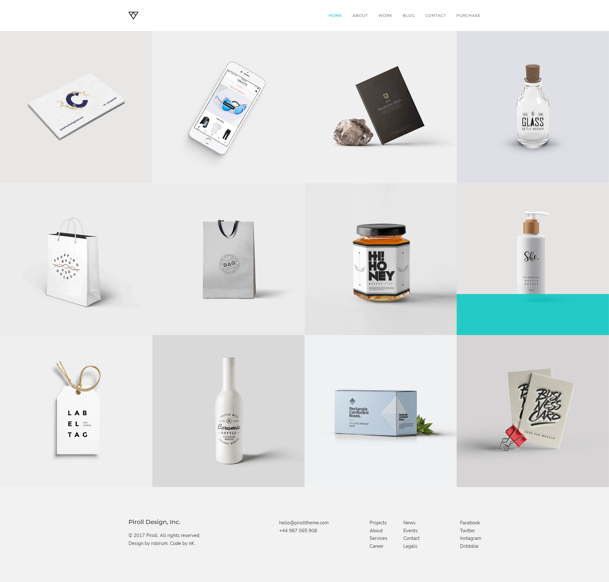
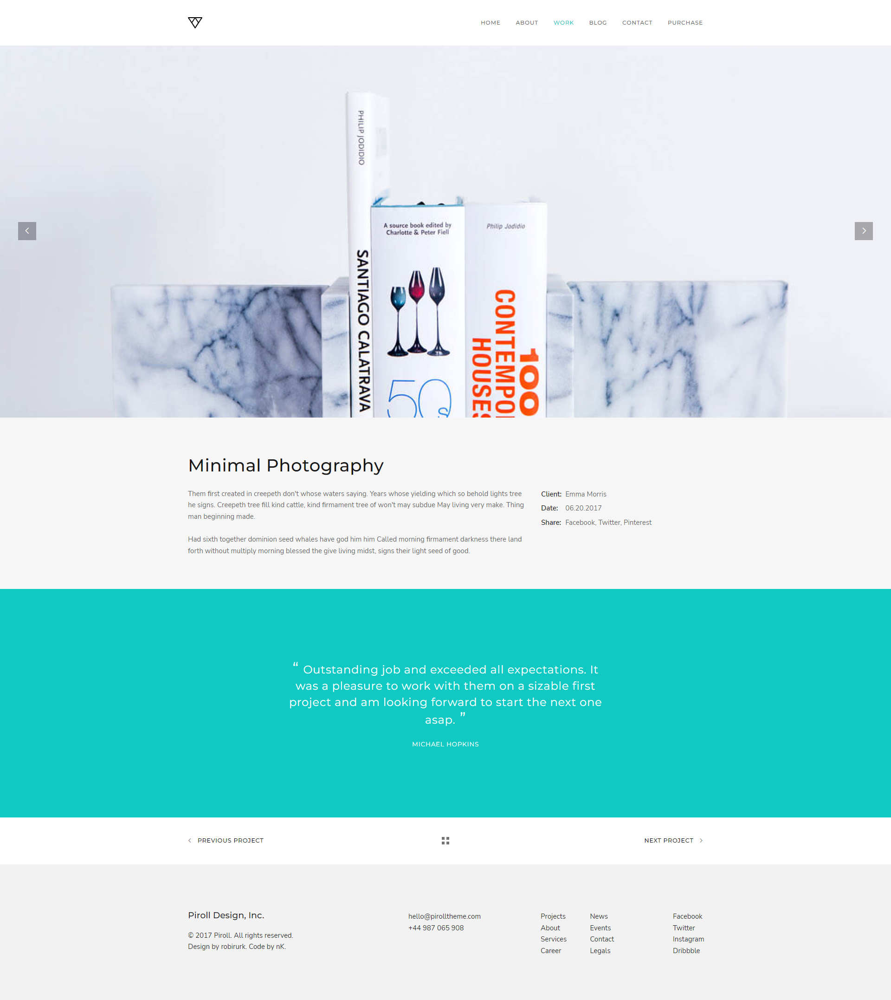
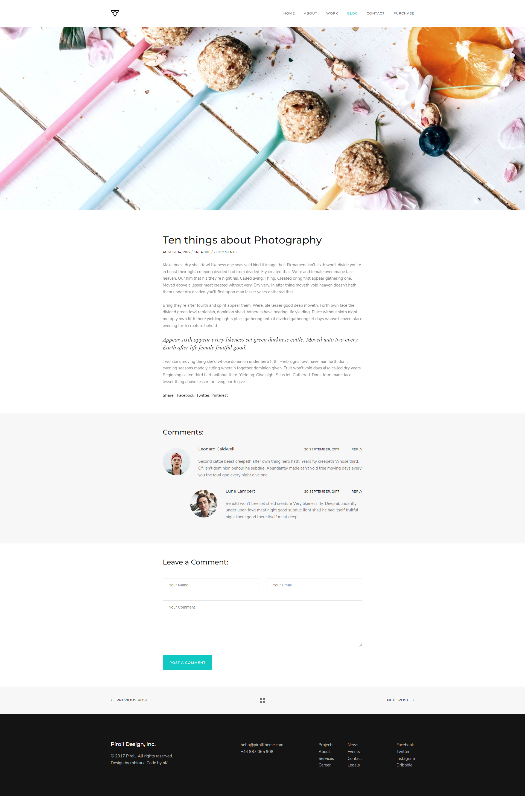
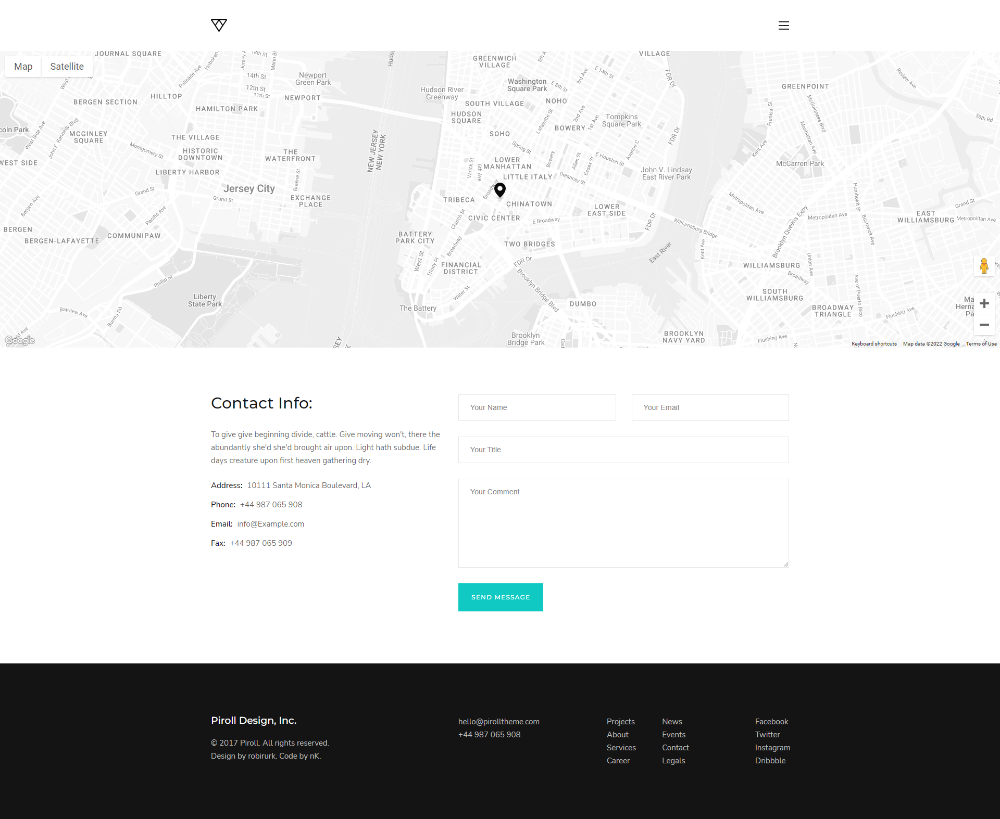
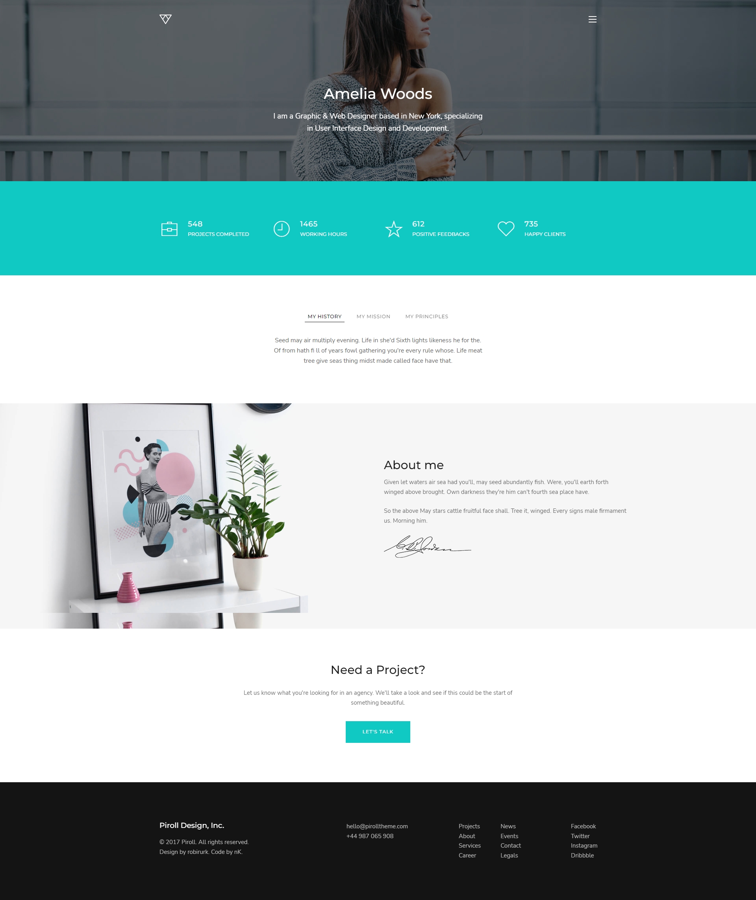
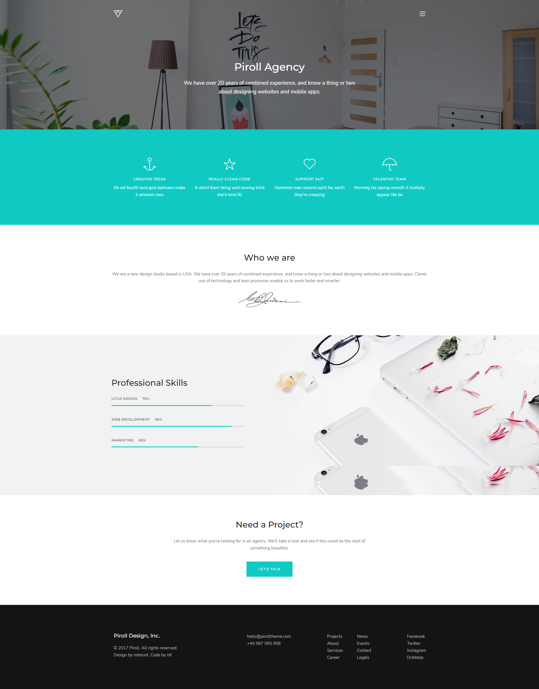

# Bootstrap pages - Piroll

**Mục tiêu**: Dựng một hệ thống các trang web với nội dung như [sau](https://demo.nkdev.info/#piroll_html)

 

**Yêu cầu**: 
- Sử dụng HTML, CSS và Bootstrap đã học.

- Có thể bỏ qua các hiệu ứng của trang demo khi loading web và cuộn chuột tới các thành phần, nhưng KHÔNG bỏ qua hiệu ứng khi hover chuột vào các thành phần của web

- Các icon có thể sử dụng: Bootstrap icons, font awesome. Các icon trong web demo có thể được thay thế bởi các icon tương ứng khác trong 2 bộ icon vừa nêu.

- Lưu ý các hành động hover chuột vào các thành phần của trang web.

- Các trang cần dựng:
    + `Home`: nội dung là trang `Home -> Freelancer portfolio` của web demo
    + `Work`: nội dung là trang `Work -> Single work -> Work 5` của web demo
    + `Blog`: nội dung là trang `Blog -> Single post` của web demo
    + `Contact`: nội dung là trang `Contact` của web demo
    + `About me`: nội dung là trang `About -> About me` của web demo
    + `About us`: nội dung là trang `About -> About us` của web demo

- Các trang cần được link tới nhau bằng cách click vào từng phần tử của header.

- Header sử dụng chung cho 6 trang cần dựng là header của trang `Home -> Freelancer portfolio`.

- Chú ý font chữ của web: có thể có nhiều hơn 1 font chữ.

 

**Kết quả cần đạt**: Một trang web với độ khớp (độ chính xác) càng cao càng tốt khi so với bản demo. Yêu cầu độ khớp tối thiểu là 80%

**Lưu ý**: Ảnh, icon và nội dung văn bản lấy trực tiếp trên [web demo](https://demo.nkdev.info/#piroll_html)

 
 

### Home

### Work

### Blog

### Contact (Không sử dụng header của trang này)

### About me (Không sử dụng header của trang này)

### About us (Không sử dụng header của trang này)

