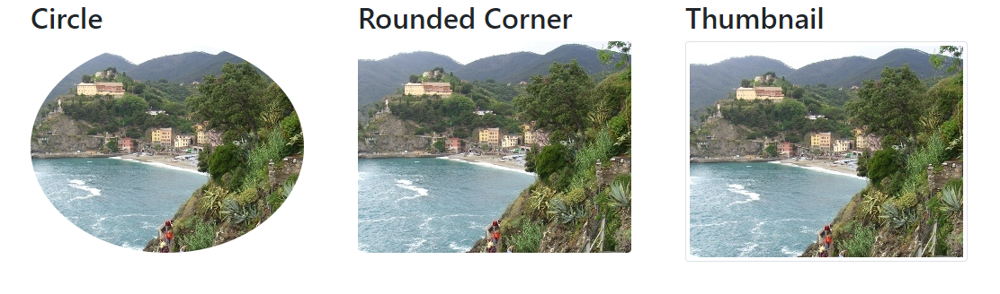

# Bootstrap 4 tutorial
# 1. Giới thiệu bootstrap
- Bootstrap là một nền tảng giao diện người dùng (front-end) miễn phi cho việc phát triển web trở nên nhanh chóng và dễ dàng hơn.
- Bootstrap bao gồm các mẫu thiết kế dựa trên HTML và CSS cho kiểu chữ, biểu mẫu, nút, bảng, điều hướng, phương thức, hình ảnh và nhiều thứ khác, cũng như các plugin JavaScript tùy chọn.
- Bootstrap cùng đem lại cho chúng ta khả năng tạo các thiết kế responsive một các dễ dàng.
- Bootstrap có các phiên bản 3, 4,  5; ở chương trình học này chúng ta sẽ tìm hiểu về Bootstrap 4
- **Những lợi ích của Bootstrap:**
    - `Dễ sử dụng`: chỉ cần biết những kiến thức cơ bản của HTML & CSS là có thể bắt đầu sử dụng bootstrap
    - `Đặc trưng linh hoạt`: Tính linh hoạt CSS của bootstrap điều chỉnh cho cả di động, mày tính bảng và máy tính
    - `Cách tiếp cận ưu tiên cho di động`: Trong bootstrap, những định kiểu style cho di động là một phần của nền tảng cốt lõi
    - `Tính tương thích của trình duyệt`: Bootstrap 4 tương thích với tất cả các trình duyệt hiện đại (Chrome, IE, Safari,...)
- **Có 2 cách để bắt đầu sử dụng Bootstrap 4:**
    - Cách 1: Bao gồm Bootstrap 4 từ một `CDN (Content Delivery Network: Mạng phân phối nội dung)`. Với cách này, chúng ta không phải tải và lưu trữ Bootstrap 4, chỉ cần bao gồm jQuery trong mã lệnh của chúng ta như sau:

        ```html
        <!-- Latest compiled and minified CSS -->
        <link rel="stylesheet" href="https://cdn.jsdelivr.net/npm/bootstrap@4.6.1/dist/css/bootstrap.min.css">

        <!-- jQuery library -->
        <script src="https://cdn.jsdelivr.net/npm/jquery@3.6.0/dist/jquery.slim.min.js"></script>

        <!-- Popper JS -->
        <script src="https://cdn.jsdelivr.net/npm/popper.js@1.16.1/dist/umd/popper.min.js"></script>

        <!-- Latest compiled JavaScript -->
        <script src="https://cdn.jsdelivr.net/npm/bootstrap@4.6.1/dist/js/bootstrap.bundle.min.js"></script>
        ```
    - Cách 2: Download Bootstrap 4: tham khảo hướng dẫn tại [Downloading Bootstrap Instructions](https://getbootstrap.com/)

# 2. Tạo trang web đầu tiên với bootstrap 4
## 2.1. Thêm loại tài liệu HTML5
- Bootstrap 4 sử dụng HTML và CSS được yêu cầu trong loại tài liệu HTML5.
- `Luôn` bao gồm đoạn mã sau khi bắt đầu trang:

    ```html
    <!DOCTYPE html> <!--HTML5 doctype-->
    <html lang="en"> <!--Thuộc tính lang-->
    <head>
        <meta charset="utf-8"> <!--Thiết lập bộ ký tự-->
    </head>
    </html>
    ```
## 2.2. Bootstrap 4 ưu tiên thiết bị di động
- Để đảm bảo hiển thị chính xác và thu phóng cảm ứng, hãy thêm thẻ `<meta>` sau vào bên trong phần tử `<head>`:

    ```html
    <meta name="viewport" content="width=device-width, initial-scale=1">
    ```
## 2.3. Containers
### 2.3.1. Các lớp container
- Bootstrap 4 cũng yêu cầu một phần tử chứa (`container`) để bao bọc các nội dung 
- Có 2 loại lớp container:
    - `.container`: cung cấp một phần tử chứa có chiều rộng cố định. Lưu ý rằng chiều rộng của nó (`max-width`) sẽ thay đổi trên các kích thước màn hình khác nhau, như bảng dưới đây:

    <p align="center">
    
    </p>

    - `.container-fluid`: cung cấp một phần tử chứa có chiều rộng bằng tổng chiều rộng của khung nhìn trình duyệt. Chiều rộng tối đa của nó (`max-width`) luôn bằng 100%  

VD:
- `Class .container`
    ```html
    <!DOCTYPE html>
    <html lang="en">
    <head>
    <title>Bootstrap Example</title>
    <meta charset="utf-8">
    <meta name="viewport" content="width=device-width, initial-scale=1">
    <link rel="stylesheet" href="https://cdn.jsdelivr.net/npm/bootstrap@4.6.1/dist/css/bootstrap.min.css">
    <script src="https://cdn.jsdelivr.net/npm/jquery@3.6.0/dist/jquery.slim.min.js"></script>
    <script src="https://cdn.jsdelivr.net/npm/popper.js@1.16.1/dist/umd/popper.min.js"></script>
    <script src="https://cdn.jsdelivr.net/npm/bootstrap@4.6.1/dist/js/bootstrap.bundle.min.js"></script>
    </head>
    <body>
    
    <div class="container">
    <h1>My First Bootstrap Page</h1>
    <p>This part is inside a .container class.</p> 
    <p>The .container class provides a responsive fixed width container.</p>           
    </div>

    </body>
    </html>
    ```
    <p align="center">
    
    </p>

- Class `.container-fluid`
    ```html
    <!DOCTYPE html>
    <html lang="en">
    <head>
    <title>Bootstrap Example</title>
    <meta charset="utf-8">
    <meta name="viewport" content="width=device-width, initial-scale=1">
    <link rel="stylesheet" href="https://cdn.jsdelivr.net/npm/bootstrap@4.6.1/dist/css/bootstrap.min.css">
    <script src="https://cdn.jsdelivr.net/npm/jquery@3.6.0/dist/jquery.slim.min.js"></script>
    <script src="https://cdn.jsdelivr.net/npm/popper.js@1.16.1/dist/umd/popper.min.js"></script>
    <script src="https://cdn.jsdelivr.net/npm/bootstrap@4.6.1/dist/js/bootstrap.bundle.min.js"></script>
    </head>
    <body>
    
    <div class="container-fluid">
    <h1>My First Bootstrap Page</h1>
    <p>This part is inside a .container-fluid class.</p> 
    <p>The .container-fluid class provides a responsive fixed width container.</p>           
    </div>

    </body>
    </html>
    ```
    <p align="center">
    
    </p>

### 2.3.2. Container Padding
- Mặc định, `containers` sẽ có phần padding trái và phải bằng 15px, không có padding trên và dưới.
- Chúng ta có thể sử dụng `spacing utilities` (những tiện ích về khoảng cách) để thêm `padding` và `margin` cho `containers`.
- VD:
    ```html
    <!-- Thêm padding-top: 16px; cho container -->
    <div class="container pt-3"></div> 
    ```

    ```html
    <!-- Thêm padding: 16px;
        my-3: - margin-top, margin-right: 16px (my là margin theo trục y)
        bg-dark: màu nền đen
        text-white: màu chữ trắng
    -->
    <div class="container p-3 my-3 bg-dark text-white"></div>
    ```
    <p align="center">
    
    </p>
# 3. Bootstrap 4 Grids
## 3.1. Grid System
- `Grid system` (hệ thống dạng lưới) được xây dựng với `flexbox` và cho phép có đến 12 cột trên trang.
 - Chúng ta có thể nhóm các cột lại với nhau để tạo ra các cột rộng hơn. VD:

    <p align="center">
    
    </p>
- `Grid system` có tính linh hoạt, và các cột có thể thay đổi 1 cách tự động phụ thuộc vào kích thước của màn hình.
- Đảm bảo rằng tổng số cột cộng lại là ít hơn hoặc bằng 12.

## 3.2. Grid classes
- Trong Bootstrap 4, grid system có 5 lớp:
    - `.col-` : thiết bị siêu nhỏ - kích thước màn hình nhỏ hơn 576px.
    - `col-sm`: thiết bị nhỏ - kích thước màn hình lớn hơn hoặc bằng 576px.
    - `col-md-`: thiết bị trung bình - kích thước màn hình lớn hơn hoặc bằng 768px.
    - `col-lg-`: thiết bị lớn - kích thước màn hình lớn hơn hoặc bằng 992px.
    - `col-xl-`: thiết bị siêu lớn - kích thước màn hình lớn hơn hoặc bằng 1200px.
## 3.3. Cấu trúc cơ bản của bootstrap 4 grid
- Dưới đây là cấu trúc cơ bản của một bootstrap 4 grid:
    ```html
    <div class="row">
        <div class="col-*-*"></div>
        <div class="col-*-*"></div>
    </div>
    <div class="row">
    <div class="col-*-*"></div>
        <div class="col-*-*"></div>
        <div class="col-*-*"></div>
    </div>
    ```
    - Trong đó:
        - Tạo một hàng với thẻ `<div>` có `class="row"`
        - Thêm số lượng cột muốn thêm với phần tử div có `class="col-*-*"`. Ở đây, dấu `*` đầu tiên đại diện cho khả năng đáp ứng linh hoạt: `sm|md|lg|xl`. Còn dấu `*` thứ hai đại diện cho một con số - nó có thể lên đến 12.
- Ngoài ra, chúng ta cũng có thể để cho bootstrap tự động điều chỉnh bố cục cột như sau:
    ```html
    <div class="row">
        <div class="col"></div>
        <div class="col"></div>
        <div class="col"></div>
    </div>
    ```
    - Bootstrap sẽ tự điều chỉnh cho các cột có kích thước bằng nhau. Nếu có 2 cột thì chiều rộng mỗi cột là 50%, có 3 cột thì chiều rộng mỗi cột là 33.3%...

    VD:
    ```html
    <!DOCTYPE html>
    <html lang="en">
    <head>
    <title>Bootstrap Example</title>
    <meta charset="utf-8">
    <meta name="viewport" content="width=device-width, initial-scale=1">
    <link rel="stylesheet" href="https://cdn.jsdelivr.net/npm/bootstrap@4.6.1/dist/css/bootstrap.min.css">
    <script src="https://cdn.jsdelivr.net/npm/jquery@3.6.0/dist/jquery.slim.min.js"></script>
    <script src="https://cdn.jsdelivr.net/npm/popper.js@1.16.1/dist/umd/popper.min.js"></script>
    <script src="https://cdn.jsdelivr.net/npm/bootstrap@4.6.1/dist/js/bootstrap.bundle.min.js"></script>
    </head>
    <body>

    <div class="container-fluid">
    <h1>Three equal width columns</h1>
    
    <div class="row">
        <div class="col" style="background-color:lavender;">.col</div>
        <div class="col" style="background-color:orange;">.col</div>
        <div class="col" style="background-color:lavender;">.col</div>
    </div>
    </div>
    </body>
    </html>
    ```
<p align="center">

</p>

# 4. Bootstrap 4 Typography
## 4.1. Những thiết lập mặc định của Bootstrap 4
- Bootstrap 4 sử dụng một kích thước cỡ chữ mặc định là `font-size: 16px`, chiều cao dòng `line-height là 1.5`
- Kiểu chữ mặc định font-family: `"Helvetica Neue", Helevetica, Aria, sans-serif`.
- Hơn nữa, tất cả phần tử `<p>` có `margin-top: 0` và `margin-bottom: 1rem (16px)`
- Bootstrap 4 định kiểu style của các thẻ tiêu đề HTML (`<h1>` đến `<h6>`) với độ dày phông chữ đậm hơn và kích thước phông chữ tăng lên.  

    VD:
    ```html
    <div class="container">
    <h1>h1 Bootstrap heading (2.5rem = 40px)</h1>
    <h2>h2 Bootstrap heading (2rem = 32px)</h2>
    <h3>h3 Bootstrap heading (1.75rem = 28px)</h3>
    <h4>h4 Bootstrap heading (1.5rem = 24px)</h4>
    <h5>h5 Bootstrap heading (1.25rem = 20px)</h5>
    <h6>h6 Bootstrap heading (1rem = 16px)</h6>
    </div>
    ```
<p align = "center">

</p>

## 4.2 Các thẻ tiêu đề hiển thị
- Các tiêu đề hiển thị được sử dụng để nổi bật hơn so với tiêu đề thông thường (cỡ chữ lớn hơn và độ dày của phông chữ nhẹ hơn) và có bốn loại để chọn: `.display-1, .display-2, .display-3, .display- 4.`  

    VD:
    ```html
    <div class="container">
    <h1>Display Headings</h1>
    <h1 class="display-1">Display 1</h1>
    <h1 class="display-2">Display 2</h1>
    <h1 class="display-3">Display 3</h1>
    <h1 class="display-4">Display 4</h1>
    </div>
    ```
<p align = "center">

</p>

## 4.3. Phần tử `<small>`
- Trong Bootstrap 4, phần tử `<small>` được sử dụng để tạo một văn bản phụ, nhẹ hơn trong bất kỳ tiêu đề nào.  

    VD:
    ```html
    <div class="container">
    <h1>Lighter, Secondary Text</h1>     
    <h1>h1 heading <small>secondary text</small></h1>
    <h2>h2 heading <small>secondary text</small></h2>
    <h3>h3 heading <small>secondary text</small></h3>
    <h4>h4 heading <small>secondary text</small></h4>
    <h5>h5 heading <small>secondary text</small></h5>
    <h6>h6 heading <small>secondary text</small></h6>
    </div>
    ```
<p align = "center">

</p>

## 4.4. Phần tử `<abbr>`
- Bootstrap 4 sẽ định kiểu style cho phần tử `<abbr>` bằng đường viền bên dưới là những chấm tròn  

    VD:
    ```html
    <div class="container">
    <h1>Abbreviations</h1>
    <p>The abbr element is used to mark up an abbreviation or acronym:</p>
    <p>The <abbr title="World Health Organization">WHO</abbr> was founded in 1948.</p>
    </div>
    ```
<p align = "center">

</p>

## 4.5. Phần tử `<blockquote>`
- Thêm lớp `.blockquote` tới phần tử `<blockquote>` khi trích dẫn những khối nội dung từ một nguồn khác.
- Thêm lớp `.blockquote-footer` tới phần tử `<footer>` khi trích dẫn tên nguồn  

    VD:
    ```html
    <div class="container">
    <h1>Blockquotes</h1>
    <p>The blockquote element is used to present content from another source:</p>
    <blockquote class="blockquote">
        <p>For 50 years, WWF has been protecting the future of nature. The world's leading conservation organization, WWF works in 100 countries and is supported by 1.2 million members in the United States and close to 5 million globally.</p>
        <footer class="blockquote-footer">From WWF's website</footer>
    </blockquote>
    </div>
    ```
<p align = "center">

</p>

## 4.6. Một số lớp Typography trong Bootstrap 4
- `.font-weight-bold`: định kiểu chữ đậm
- `.font-italic`: kiểu chữ nghiêng
- `.font-weight-normal`: kiểu chữ bình thường
- `.small`: chỉ định chữ có kích thước nhỏ hơn( bằng 80% so với kích thước chữ của phần tử cha)
- `.text-*-center`: Cho biết văn bản căn giữa trên màn hình nhỏ, trung bình, lớn hoặc xlarge
- `.text-nowrap`: chỉ định văn bản không xuống dòng.
...  
Có thể tham khảo thêm các lớp Typogrraphy tại [More Typography Classes](https://www.w3schools.com/bootstrap4/bootstrap_typography.asp)

# 5. Bootstrap 4 Colors
## 5.1. Text Colors
- Bootstrap 4 có 1 số lớp theo ngữ cảnh có thể được sử dụng để cung cấp "ý nghĩa thông qua màu sắc"
- Các lớp cho màu văn bản là: `.text-muted, .text-primary, .text-success, .text-info, .text-warning, .text-danger, .text-secondary, .text-white, .text- dark, .text-body (mặc định thường là màu đen) và .text-light`  

    VD:
    ```html
    <div class="container">
    <h2>Contextual Colors</h2>
    <p>Use the contextual classes to provide "meaning through colors":</p>
    <p class="text-muted">This text is muted.</p>
    <p class="text-primary">This text is important.</p>
    <p class="text-success">This text indicates success.</p>
    <p class="text-info">This text represents some information.</p>
    <p class="text-warning">This text represents a warning.</p>
    <p class="text-danger">This text represents danger.</p>
    <p class="text-secondary">Secondary text.</p>
    <p class="text-dark">This text is dark grey.</p>
    <p class="text-body">Default body color (often black).</p>
    <p class="text-light">This text is light grey (on white background).</p>
    <p class="text-white">This text is white (on white background).</p>
    </div>
    ```
<p align = "center">

</p>

- Các lớp văn bản theo ngữ cảnh cũng có thể được sử dụng trên các liên kết, điều này sẽ làm cho màu tối hơn khi di chuột vào.  

    VD:
    ```html
    <div class="container">
    <h2>Contextual Link Colors</h2>
    <p>Hover over the links.</p>
    <a href="#" class="text-muted">Muted link.</a>
    <a href="#" class="text-primary">Primary link.</a>
    <a href="#" class="text-success">Success link.</a>
    <a href="#" class="text-info">Info link.</a>
    <a href="#" class="text-warning">Warning link.</a>
    </div>
    ```
<p align = "center">

</p>

- Chúng ta cũng có thể thêm độ trong suốt 50% cho màu văn bản trắng hoặc đen với lớp `.text-black-50 và .text-white-50`.  

    VD:
    ```html
    <div class="container">
    <h2>Opacity Text Colors</h2>
    <p class="text-danger-50">Black text with 50% opacity on white background</p>
    <p class="text-white-50 bg-dark">White text with 50% opacity on black background</p>
    </div>
    ```
<p align = "center">

</p>

## 5.2. Background Colors
- Các lớp cho màu nền là: `.bg-primary, .bg-success, .bg-info, .bg-warning, .bg-danger, .bg-secondary, .bg-dark và .bg-light`.
- *Chú ý*: màu nền không đặt màu văn bản, vì vậy trong một số trường hợp, chúng sẽ muốn sử dụng màu nền cùng với một lớp `.text-*`  

    VD:
    ```html
    <div class="container">
    <h2>Contextual Backgrounds</h2>
    <p>Note that you can also add a .text-* class if you want a different text color:</p>
    <p class="bg-primary">This text is important.</p>
    <p class="bg-success text-white">This text indicates success.</p>
    <p class="bg-info text-white">This text represents some information.</p>
    <p class="bg-warning text-white">This text represents a warning.</p>
    <p class="bg-danger text-white">This text represents danger.</p>
    <p class="bg-secondary text-white">Secondary background color.</p>
    <p class="bg-dark text-white">Dark grey background color.</p>
    <p class="bg-light text-dark">Light grey background color.</p>
    </div>
    ```
<p align = "center">

</p>

# 6. Bootstrap 4 Tables
## 6.1. Bootstrap 4 Basic Table
- Một bảng bootstrap 4 cơ bản có một phần padding nhẹ và chia ngang.
- Sử dụng lớp `.table` để thêm những định kiểu cơ bản cho một bảng bootstrap  

    VD:
    ```html
    <div class="container">
    <h2>Basic Table</h2>         
    <table class="table">
        <thead>
        <tr>
            <th>Firstname</th>
            <th>Lastname</th>
            <th>Email</th>
        </tr>
        </thead>
        <tbody>
        <tr>
            <td>John</td>
            <td>Doe</td>
            <td>john@example.com</td>
        </tr>
        <tr>
            <td>Mary</td>
            <td>Moe</td>
            <td>mary@example.com</td>
        </tr>
        <tr>
            <td>July</td>
            <td>Dooley</td>
            <td>july@example.com</td>
        </tr>
        </tbody>
    </table>
    </div>
    ```
<p align = "center">

</p>

## 6.2. Striped Rows
- Lớp `.table-striped` được thêm vào để tạo các dòng có sọc xen kẽ trong 1 bảng   

    VD:
    ```html
    <div class="container">
    <h2>Striped Rows</h2>
    <p>The .table-striped class adds zebra-stripes to a table:</p>            
    <table class="table table-striped">
        <thead>
        <tr>
            <th>Firstname</th>
            <th>Lastname</th>
            <th>Email</th>
        </tr>
        </thead>
        <tbody>
        <tr>
            <td>John</td>
            <td>Doe</td>
            <td>john@example.com</td>
        </tr>
        <tr>
            <td>Mary</td>
            <td>Moe</td>
            <td>mary@example.com</td>
        </tr>
        <tr>
            <td>July</td>
            <td>Dooley</td>
            <td>july@example.com</td>
        </tr>
        </tbody>
    </table>
    </div>
    ```
<p align = "center">

</p>

## 6.3. Bordered Table
- Lớp `.table-bordered` sẽ thêm các đường viền cho tất cả các cạnh của bảng và ô trong bảng  

    VD:
    ```html
    <table class="table table-bordered">
        <thead>
        <tr>
            <th>Firstname</th>
            <th>Lastname</th>
            <th>Email</th>
        </tr>
        </thead>
        <tbody>
        <tr>
            <td>John</td>
            <td>Doe</td>
            <td>john@example.com</td>
        </tr>
        <tr>
            <td>Mary</td>
            <td>Moe</td>
            <td>mary@example.com</td>
        </tr>
        <tr>
            <td>July</td>
            <td>Dooley</td>
            <td>july@example.com</td>
        </tr>
        </tbody>
    </table>
    ```
<p align = "center">

</p>

## 6.4. Hover Rows
- Lớp `.table-hover` thêm một hiệu ứng di chuột (dòng được di chuột vào sẽ có màu nền là màu xám).  

    VD:
    ```html
    <table class="table table-hover">
        <thead>
        <tr>
            <th>Firstname</th>
            <th>Lastname</th>
            <th>Email</th>
        </tr>
        </thead>
        <tbody>
        <tr>
            <td>John</td>
            <td>Doe</td>
            <td>john@example.com</td>
        </tr>
        <tr>
            <td>Mary</td>
            <td>Moe</td>
            <td>mary@example.com</td>
        </tr>
        <tr>
            <td>July</td>
            <td>Dooley</td>
            <td>july@example.com</td>
        </tr>
        </tbody>
    </table>
    ```
<p align = "center">

</p>

## 6.5. Black/Dark Table
- Lớp `.table-dark` sẽ thêm một màu nền đen cho bảng.  

    VD:
    ```html
    <table class="table table-dark">
        <thead>
        <tr>
            <th>Firstname</th>
            <th>Lastname</th>
            <th>Email</th>
        </tr>
        </thead>
        <tbody>
        <tr>
            <td>John</td>
            <td>Doe</td>
            <td>john@example.com</td>
        </tr>
        <tr>
            <td>Mary</td>
            <td>Moe</td>
            <td>mary@example.com</td>
        </tr>
        <tr>
            <td>July</td>
            <td>Dooley</td>
            <td>july@example.com</td>
        </tr>
        </tbody>
    </table>
    ```
<p align = "center">

</p>

## 6.6. Borderless table
- Lớp `.table-borderless` được thêm vào để xóa bỏ đường viền của bảng  

    VD:
    ```html
    <table class="table table-borderless">
        <thead>
        <tr>
            <th>Firstname</th>
            <th>Lastname</th>
            <th>Email</th>
        </tr>
        </thead>
        <tbody>
        <tr>
            <td>John</td>
            <td>Doe</td>
            <td>john@example.com</td>
        </tr>
        <tr>
            <td>Mary</td>
            <td>Moe</td>
            <td>mary@example.com</td>
        </tr>
        <tr>
            <td>July</td>
            <td>Dooley</td>
            <td>july@example.com</td>
        </tr>
        </tbody>
    </table>
    ```
<p align = "center">

</p>

## 6.7. Contextual Classes
- Các lớp theo ngữ cảnh có thể được sử dụng để thiết lập màu sắc cho cả bảng (`<table>`), cho các dòng (`<tr>`) hoặc các ô (`<td>`) trong bảng.  

    VD:
    ```html
    <table class="table">
        <thead>
        <tr>
            <th>Firstname</th>
            <th>Lastname</th>
            <th>Email</th>
        </tr>
        </thead>
        <tbody>
        <tr>
            <td>Default</td>
            <td>Defaultson</td>
            <td>def@somemail.com</td>
        </tr>      
        <tr class="table-primary">
            <td>Primary</td>
            <td>Joe</td>
            <td>joe@example.com</td>
        </tr>
        <tr class="table-success">
            <td>Success</td>
            <td>Doe</td>
            <td>john@example.com</td>
        </tr>
        <tr class="table-danger">
            <td>Danger</td>
            <td>Moe</td>
            <td>mary@example.com</td>
        </tr>
        </tbody>
    </table>
    ```
<p align = "center">

</p>

## 6.8. Responsive Tables
- Lớp `.table-responsive` được thêm vào để trình duyệt tạo một thanh cuộn ngang cho bảng khi cần thiết (khi bảng có kích thước chiều rộng quá lớn)  

    VD:
    ```html
    <div class="table-responsive">
        <table class="table table-bordered">
        <thead>
            <tr>
            <th>#</th>
            <th>Firstname</th>
            <th>Lastname</th>
            <th>Age</th>
            <th>City</th>
            <th>Country</th>
            <th>Sex</th>
            <th>Example</th>
            <th>Example</th>
            <th>Example</th>
            <th>Example</th>
            <th>Example</th>
            <th>Example</th>
            <th>Example</th>
            <th>Example</th>
            <th>Example</th>
            <th>Example</th>
            <th>Example</th>
            <th>Example</th>
            </tr>
        </thead>
        <tbody>
            <tr>
            <td>1</td>
            <td>Anna</td>
            <td>Pitt</td>
            <td>35</td>
            <td>New York</td>
            <td>USA</td>
            <td>Female</td>
            <td>Yes</td>
            <td>Yes</td>
            <td>Yes</td>
            <td>Yes</td>
            <td>Yes</td>
            <td>Yes</td>
            <td>Yes</td>
            <td>Yes</td>
            <td>Yes</td>
            <td>Yes</td>
            <td>Yes</td>
            <td>Yes</td>
            </tr>
        </tbody>
        </table>
    </div>
    ```
<p align = "center">

</p>

- Chúng ta cũng có thể quyết định khi nào bảng sẽ thêm một thanh cuộn ngang, tùy thuộc vào chiều rộng của màn hình bằng 1 trong các lớp `table-responsive` sau:
    - `.table-responsive-sm`: chiều rộng màn hình < 576px
    - `.table-responsive-md`: chiều rộng màn hình < 768px
    - `.table-responsive-lg`: chiều rộng màn hình < 992px
    - `.table-responsive-xl`: chiều rộng màn hình < 1200px
## 6.9. Một số lớp table khác trong Bootstrap 4
- `.thead-dark`: thêm 1 màu nền đen tới các ô tiêu đề của bảng.
- `.thead-light`: thêm 1 màu nền xám tới các ô tiêu đề của bảng.
- `.table-sm`: Làm cho bảng nhỏ hơn (cắt phần padding của các ô trong bảng đi một nửa).

# 7. Bootstrap 4 Forms
## 7.1. Các thiết lập mặc định của biểu mẫu trong Bootstrap 4
- Các điều khiển biểu mẫu sẽ tự động nhận các định kiểu style toàn cầu của Bootstrap
- Tất cả các phần tử `<input>`, `<textarea>`, `<select>` với lớp `.form-control` sẽ có chiều rộng là 100%
## 7.2. Bố cục biểu mẫu của Bootstrap 4
- Bootstrap 4 cung cấp 2 loại bố cục biểu mẫu:
    - `Stacked form`: bố cục biểu mẫu theo chiều dọc
    - `Inline form`: bố cục biểu mẫu nội tuyến
### 7.2.1. Bootstrap 4 stacked form
- Đây là dạng bố cục biểu mẫu mặc định trong Bootstrap, trong đó các style được áp dụng cho các lớp `.form-control` mà không cần bổ sung thêm lớp cơ sở nào cho phần tử form.
- Các lớp form-control trong dạng bố cục này được xếp chồng lên nhau với các nhãn `left-aligned` ở góc trên cùng.
- Với loại bố cục này, các phần tử đều sử dụng lớp `.form-control`, sẽ có chiều rộng là 100%
- Thêm một phần tử bao bọc với lớp `.form-group`, xung quanh mỗi điều khiển biểu mẫu, để đảm bảo margin phù hợp:  

    VD:
    ```html
    <form action="/action_page.php">
    <div class="form-group">
        <label for="email">Email address:</label>
        <input type="email" class="form-control" placeholder="Enter email" id="email">
    </div>
    <div class="form-group">
        <label for="pwd">Password:</label>
        <input type="password" class="form-control" placeholder="Enter password" id="pwd">
    </div>
    <div class="form-group form-check">
        <label class="form-check-label">
        <input class="form-check-input" type="checkbox"> Remember me
        </label>
    </div>
    <button type="submit" class="btn btn-primary">Submit</button>
    </form>
    ```
<p align = "center">

</p>

### 7.2.2. Inline Form
- Bố cục biểu mẫu nội tuyến là tất cả các phần tử trong biểu mẫu được hiển thị trên cùng 1 hàng, và được căn trái `left-aligned`.
- *Lưu ý:* bố cục này chỉ áp dụng cho khung nhìn có chiều rộng tối thiểu là 576px. Nếu màn hình nhỏ hơn, các phần tử sẽ xếp chồng lên nhau theo chiều ngang.
- Để tạo bố cục biểu mẫu nội tuyến chỉ cần thêm lớp `.form-inline` vào phần tử `<form>`  

    VD:
    ```html
    <form class="form-inline" action="/action_page.php">
    <label for="email">Email address:</label>
    <input type="email" class="form-control" placeholder="Enter email" id="email">
    <label for="pwd">Password:</label>
    <input type="password" class="form-control" placeholder="Enter password" id="pwd">
    <div class="form-check">
        <label class="form-check-label">
        <input class="form-check-input" type="checkbox"> Remember me
        </label>
    </div>
    <button type="submit" class="btn btn-primary">Submit</button>
    </form>
    ```
<p align = "center">

</p>

### 7.2.3. Inline form with utilities
- Ở ví dụ trên, các phần tử trong biểu mẫu hiển thị liền sát nhau, để cho bố cục đẹp mắt hơn chúng ta sẽ sử dụng thêm các tiện ích khoảng cách của bootstrap 4.
- Ở ví dụ trên, chúng ta thêm một margin phải cho các phần tử input trong biểu mẫu với lớp `.mr-sm-2`, (sm chỉ định được áp dụng trên tất cả các thiết bị nhỏ và lớn).
- Thêm một margin dưới với lớp `.mb-2` để định kiểu cho các trường input khi nó bị ngắt xuống dòng (do không đủ kích thước chiều rộng).  

    VD:
    ```html
    <form class="form-inline" action="/action_page.php">
    <label for="email" class="mr-sm-2">Email address:</label>
    <input type="email" class="form-control mb-2 mr-sm-2" placeholder="Enter email" id="email">
    <label for="pwd" class="mr-sm-2">Password:</label>
    <input type="password" class="form-control mb-2 mr-sm-2" placeholder="Enter password" id="pwd">
    <div class="form-check mb-2 mr-sm-2">
        <label class="form-check-label">
        <input class="form-check-input" type="checkbox"> Remember me
        </label>
    </div>
    <button type="submit" class="btn btn-primary mb-2">Submit</button>
    </form>
    ```
<p align = "center">

</p>

## 7.3. Form Row/Grid
- Chúng ta cũng có thể sử dụng cột (`.col`) để điều chỉnh chiều rộng và sự căn chỉnh cho các trường input của biểu mẫu mà không sử dụng tiện ích khoảng cách trong bootstrap. 
- Đặt các trường này vào bên trong một phần tử chứa có lớp `.row`  
    VD:
    ```html
    <form>
    <div class="row">
        <div class="col">
        <input type="text" class="form-control" id="email" placeholder="Enter email" name="email">
        </div>
        <div class="col">
        <input type="password" class="form-control" placeholder="Enter password" name="pswd">
        </div>
    </div>
    </form>
    ```
<p align = "center">

</p>

## 7.4. Form Validation
- Chúng ta có thể sử dụng các lớp xác thực khác nhau để cung cấp những phản hồi có giá trị tới người dùng.
- Thêm lớp `.was-validated` hoặc `.needs-validated` tới phần tử `<form>` tùy thuộc vào chúng ta muốn cung cấp phản hồi tới người dùng trước hay sau khi nộp biểu mẫu
- Các trường input sẽ có đường viền màu xanh lá (hợp lệ) hoặc màu đỏ (không hợp lệ) để chỉ ra cái gì đang bị thiếu trong biểu mẫu.
- Chúng ta cũng có thể thêm một thông điệp với lớp `.valid-feedback` hoặc `.invalid-feedback` để thông báo rõ ràng cho người dùng biết cái gì đang bị thiếu hoặc cần phải hoàn thiện trước khi thực hiện nộp biểu mẫu.  

    VD: Sử dụng lớp `.was-validated` để thông báo xác thực trước khi nộp biểu mẫu.
    ```html
    <form action="/action_page.php" class="was-validated">
    <div class="form-group">
        <label for="uname">Username:</label>
        <input type="text" class="form-control" id="uname" placeholder="Enter username" name="uname" required>
        <div class="valid-feedback">Valid.</div>
        <div class="invalid-feedback">Please fill out this field.</div>
    </div>
    <div class="form-group">
        <label for="pwd">Password:</label>
        <input type="password" class="form-control" id="pwd" placeholder="Enter password" name="pswd" required>
        <div class="valid-feedback">Valid.</div>
        <div class="invalid-feedback">Please fill out this field.</div>
    </div>
    <div class="form-group form-check">
        <label class="form-check-label">
        <input class="form-check-input" type="checkbox" name="remember" required> I agree on blabla.
        <div class="valid-feedback">Valid.</div>
        <div class="invalid-feedback">Check this checkbox to continue.</div>
        </label>
    </div>
    <button type="submit" class="btn btn-primary">Submit</button>
    </form>
    ```
<p align = "center">

</p>

# 8. Bootstrap 4 Buttons
## 8.1. Button Styles
- Bootstrap 4 cung cấp các loại button khác nhau như `.btn-default, .btn-primary, .btn-success, .btn-info, .btn-warning, .btn-danger, .btn-link, .btn-dark, .btn-light`  

    VD:
    ```html
    <div class="container">
    <h2>Button Styles</h2>
    <button type="button" class="btn">Basic</button>
    <button type="button" class="btn btn-primary">Primary</button>
    <button type="button" class="btn btn-secondary">Secondary</button>
    <button type="button" class="btn btn-success">Success</button>
    <button type="button" class="btn btn-info">Info</button>
    <button type="button" class="btn btn-warning">Warning</button>
    <button type="button" class="btn btn-danger">Danger</button>
    <button type="button" class="btn btn-dark">Dark</button>
    <button type="button" class="btn btn-light">Light</button>
    <button type="button" class="btn btn-link">Link</button>      
    </div>
    ```
<p align = "center">

</p>

- Lớp button cũng có thể được sử dụng như một phần tử liên kết `<a>`, `<input>`  

    VD:
    ```html
    <a href="#" class="btn btn-info" role="button">Link Button</a>
    <button type="button" class="btn btn-info">Button</button>
    <input type="button" class="btn btn-info" value="Input Button">
    ```
<p align = "center">

</p>

## 8.2. Button outline
- Chúng ta cũng có thể tạo ra các button chỉ có viền màu bao bên ngoài bằng cách sử dụng các lớp `.btn-outline-xxx`, với `xxx` là tên các nút button theo màu sắc: `primary, secondary, success,...`  

    VD:
    ```html
    <button type="button" class="btn btn-outline-primary">Primary</button>
    <button type="button" class="btn btn-outline-secondary">Secondary</button>
    <button type="button" class="btn btn-outline-success">Success</button>
    <button type="button" class="btn btn-outline-danger">Danger</button>
    <button type="button" class="btn btn-outline-warning">Warning</button>
    <button type="button" class="btn btn-outline-info">Info</button>
    <button type="button" class="btn btn-outline-dark">Dark</button>
    <button type="button" class="btn btn-outline-light">Light</button>
    ```
<p align = "center">

</p>

## 8.3. Button Sizes
- Sử dụng các lớp button sau để xác định các kích thước khác nhau của button: 
    - `.btn-lg`: kích thước lớn
    - `.btn-md`: kích thước vừa
    - `.btn-sm`: kích thước nhỏ
    - `.btn-xs`: kích thước nhỏ vừa

    VD:
    ```html
    <div class="container">  
    <h2>Button Sizes</h2>  
    <button type="button" class="btn btn-primary btn-lg">Large</button>  
    <button type="button" class="btn btn-primary btn-md">Medium</button>      
    <button type="button" class="btn btn-primary btn-sm">Small</button>  
    <button type="button" class="btn btn-primary btn-xs">XSmall</button>  
    </div> 
    ```
<p align = "center">

</p>

## 8.4. Block level buttons
- Thêm lớp `.btn-block` để tạo một button theo mức khối - button này sẽ có chiều rộng trải dài theo kích thước của phần tử cha.  

    VD:
    ```html
    <h2>Block Level Buttons</h2>  
    <button type="button" class="btn btn-primary btn-block">Button 1</button>  
    <button type="button" class="btn btn-default btn-block">Button 2</button>  

    <h2>Large Block Level Buttons</h2>  
    <button type="button" class="btn btn-primary btn-lg btn-block">Button 1</button>  
    <button type="button" class="btn btn-default btn-lg btn-block">Button 2</button>  
    ```
<p align = "center">

</p>

## 8.5. Active/Disable Button
- Một button có thể được thiết lập trạng thái kích hoạt (có thể nhấn được) hoặc bị vô hiệu hóa (không thế nhấn được) bằng cách thêm lớp `.active` hoặc thuộc tính `disabled`.  

    VD:
    ```html
    <button type="button" class="btn btn-primary active">Active Primary</button>
    <button type="button" class="btn btn-primary" disabled>Disabled Primary</button>
    ```
    <p align = "center">
    
    </p>

- Lưu ý: Phần tử liên kết `<a>` không hỗ trợ thuộc tính disabled, do đó nếu muốn phần tử liên kết này như một button bị vô hiệu hóa thì sử dụng lớp .disabled thêm vào phần tử `<a>`  

    VD:
    ```html
    <a href="#" class="btn btn-primary disabled">Disabled Link</a>
    ```
<p align = "center">

</p>

## 8.6. Spinner Buttons
- Chúng ta cũng có thể thêm 'spinners' cho một button như ví dụ sau:

    ```html
    <button class="btn btn-primary">
    <span class="spinner-border spinner-border-sm"></span>
    Loading..
    </button>

    <button class="btn btn-primary" disabled>
    <span class="spinner-border spinner-border-sm"></span>
    Loading..
    </button>
    ```
<p align = "center">

</p>

# 9. Bootstrap 4 Images
## 9.1. Bootstrap 4 Image Shapes
- `Rounded Corners`: thêm lớp `.rounded` để bo góc cho một hình ảnh
- `Circle`: thêm lớp `.rounded-circle` để chỉ định hình ảnh thành hình tròn
- `Thumbnail`: thêm thuộc tính `.img-thumbnail` để chỉ định hình ảnh thành 1 hình thu nhỏ.

    VD:
    ```html
    <style>
    div{
        float: left;
        margin:0 30px;
    }
    </style>
    <div class="container">
        <div>
            <h2>Circle</h2>          
             
        </div>
        <div>
            <h2>Rounded Corner</h2> 
            
        </div>
        <div>
            <h2>Thumbnail</h2> 
            
    </div>
    </div>
    ```
<p align = "center">

</p>

## 9.2. Aligning Images
- Để căn chỉnh nổi một bức ảnh ở bên trái chúng ta thêm lớp `.float-lef`t, nổi bên phải thì thêm lớp `.float-right` vào phần tử ``
- Để căn giữa một bức ảnh, thì chúng ta thêm lớp tiện ích `.mx-auto (margin:auto)` và `.d-block (display: block)` vào phần tử ``

    VD:
    ```html
    <div class="container">
    <div class="float-left">
    <h2>Aligning left</h2>
    
    </div>
    <div class="float-right">
    <h2>Aligning right</h2>
     
    </div>
    </div>
    ```
    <p align = "center">
    
    </p>

    ```html
    <div class="container">
    <h2>Centered Image</h2>
     
    </div>
    ```
<p align = "center">

</p>

## 9.3. Responsive Images
- Hình ảnh linh hoạt sẽ tự động điều chỉnh kích thước để phù hợp với kích thước của màn hình.
- Để tạo các hình ảnh linh hoạt, chúng ta thêm một lớp `.img-fluid` tới thẻ ``. Lớp `.img-fluid` áp dụng các thuộc tính `max-width: 100%;` và `height:auto;` cho hình ảnh

    VD:
    ```html
    <div class="container">
    <h2>Image</h2>
     
    </div>
    ```
<p align = "center">

</p>

# 10. Bootstrap Helper Classes
## 10.1. Lớp màu cho văn bản trong Bootstrap
- Bootstrap hỗ trợ các lớp màu cho văn bản như bảng dưới đây:

    <p align = "center">
    
    </p>

## 10.2. Lớp màu nền trong Bootstrap
- Bootstrap hỗ trợ các lớp màu nền như bảng dưới đây:

    <p align = "center">
    
    </p>

## 10.3. Các lớp căn chỉnh văn bản
- Bootstrap hỗ trợ các lớp căn chỉnh văn bản như sau:

    <p align = "center">
    
    </p>

## 10.4. Các lớp viền và bo góc đường viền trong Bootstrap
- Bootstrap hỗ trợ các lớp căn chỉnh văn bản như sau:

    <p align = "center">
    
    </p>

## 10.5. Các lớp căn chỉnh khoảng cách trong Bootstrap
- Bootstrap hỗ trợ các lớp căn chỉnh khoảng cách như sau:

    <p align = "center">
    
    </p>

- Trong đó:
    - Ký tự `#` trong các lớp `.mt-#, .pt-#`, ... đại diện cho kích thước của margin hoặc padding. Giá trị của kích thước có thể là một số nguyên từ 0 đến 5 hoặc auto.
    - Để xóa margin hoặc padding, chúng ta thiết lập giá trị kích thước là 0, hoặc thiết lập giá trị là auto để tự động thiết lập lề.

    - Các số nguyên từ 1 đến 5 thiết lập margin hoặc padding theo thứ tự tăng dần (trong khoảng từ 0.25rem đến 3rem; 1rem = 16px).

## 10.6. Các lớp căn chỉnh nội dung theo chiều dọc trong Bootstrap
- Bootstrap hỗ trợ các lớp căn chỉnh nội dung như sau:

    <p align = "center">
    
    </p>

## 10.7. Các lớp vị trí trong Bootstrap
- Bootstrap hỗ trợ các lớp vị trí văn bản như sau:

    <p align = "center">
    
    </p>

## 10.8. Float và Clearfix
- Di chuyển một phần tử sang phải với lớp `.float-right` hoặc sang trái với `.float-left` và xóa các phần tử nổi với lớp `.clearfix`:  

    VD:
    ```html
    <div class="clearfix">
        <span class="float-left">Float left</span>
        <span class="float-right">Float right</span>
    </div>
    ```

## 10.9. Responsive Floats
- Để di chuyển một phần tử sang trái hoặc phải tùy thuộc vào kích thước của màn hình bằng cách sử dụng các lớp float linh hoạt (`.float-*-left|right - * is sm (>=576px), md (>=768px), lg (>=992px) or xl (>=1200px)`).

    VD:
    ```html
    <div class="container">
    <h2>Responsive Floats</h2>
    <div class="clearfix">
        <!--Khi kích thước màn hình lớn hơn 576px thì phần tử sẽ nổi sang bên phải, nhỏ hơn 576px thì sẽ nổi sang bên trái-->
        <div class="float-sm-right">Float right on small screens or wider</div><br>

        <!--Khi kích thước màn hình lớn hơn 768px thì phần tử sẽ nổi sang bên phải, nhỏ hơn 768px thì sẽ nổi sang bên trái-->
        <div class="float-md-right">Float right on medium screens or wider</div><br>

        <!--Khi kích thước màn hình lớn hơn 992px thì phần tử sẽ nổi sang bên phải, nhỏ hơn 992px thì sẽ nổi sang bên trái-->
        <div class="float-lg-right">Float right on large screens or wider</div><br>

        <!--Khi kích thước màn hình lớn hơn 1200px thì phần tử sẽ nổi sang bên phải, nhỏ hơn 1200px thì sẽ nổi sang bên trái-->
        <div class="float-xl-right">Float right on extra large screens or wider</div><br>
        <div class="float-none">Float none</div>
    </div>
    </div>
    ```
<p align = "center">

</p>

## 10.10. Center Align
- Căn giữa một phần tử sử dụng lớp `.mx-auto` (tương đương `margin-left:auto` và `margin-right: auto`)
## 10.11. Width & height
- Thiết lập chiều rộng và chiều cao của một phần tử với lớp `.w-*` và `.h-*` (`* có thể là 25, 50, 75, 100`)

    VD: `width`
    ```html
    <div class="container">
    <h1>Width Utilities</h1>
    <p>Set the width of an element with the w-* classes:</p>
    <div class="w-25 bg-warning">Width 25%</div>
    <div class="w-50 bg-warning">Width 50%</div>
    <div class="w-75 bg-warning">Width 75%</div>
    <div class="w-100 bg-warning">Width 100%</div>
    <div class="mw-100 bg-warning">Max Width 100%</div>
    </div>
    ```
<p align = "center">

</p>

- `height`

    ```html
    <div class="container">
    <h1>Height Utilities</h1>
    <p>Set the height of an element with the h-* classes:</p>
    <div style="height:200px;background-color:#ddd">
        <div class="h-25 d-inline-block p-2 bg-warning">Height 25%</div>
        <div class="h-50 d-inline-block p-2 bg-warning">Height 50%</div>
        <div class="h-75 d-inline-block p-2 bg-warning">Height 75%</div>
        <div class="h-100 d-inline-block p-2 bg-warning">Height 100%</div>
        <div class="mh-100 d-inline-block p-2 bg-warning" style="height:500px">Max Height 100%</div>
    </div>
    </div>
    ```
<p align = "center">

</p>

## 10.12. Visibility
- Sử dụng lớp `.visible` và `.invisible` để thể hiển khả năng hiển thị của các phần tử. 
- Những lớp này không thay đổi giá trị hiển thị CSS mà nó chỉ tương đương với `visibility:visible` hoặc `visibility:hidden`

## 10.13. Close icon
- Sử dụng lớp `.close` để tạo kiểu cho biểu tượng đóng. Điều này thường được sử dụng cho các cảnh báo.
- Lưu ý chúng ta sử dụng biểu tượng `×` để tạo biểu tượng  nó nổi ở bên phải theo mặc định:

    ```html
    <button type="button" class="close">&times;</button>
    ```
<p align = "center">

</p>

## 10.14. Block Elements
- Sử dụng lớp `.d-block` để chuyển một phần tử thành 1 phần tử khối. Sử dụng bất ký lớp `.d-*-block` nào để điều khiển 1 phần tử thành 1 phần tử khối trên kích thước màn hình cụ thể.


