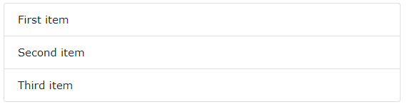

# 1. Bootstrap glyphicons
- Bootstrap cung cấp 260 glyphicons từ bộ Glyphicon Halflings
- Glyphicons có thể được sử dụng trong văn bản, nút, thanh công cụ, điều hướng, biểu mẫu, ...
- Cú pháp:

    ```html
    <span class="glyphicon glyphicon-name"></span>
    ```
    VD:
    ```html
    <div class="container">
    <h2>Glyphicon Examples</h2>
    <p>Envelope icon as a link:
        <a href="#"><span class="glyphicon glyphicon-envelope"></span></a>
    </p>
    <p>Search icon on a styled button:
        <button type="button" class="btn btn-info">
        <span class="glyphicon glyphicon-search"></span> Search
        </button>
    </p>     
    <p>Print icon on a styled link button:
        <a href="#" class="btn btn-success btn-lg">
        <span class="glyphicon glyphicon-print"></span> Print 
        </a>
    </p> 
    </div>
    ```
<p align = "center">

</p>

- Chúng ta có thể tham khảo thêm các loại glyphicons khác trong bootstrap tại [Bootstrap Glyphs](https://www.w3schools.com/bootstrap/bootstrap_ref_comp_glyphs.asp)

# 2. Bootstrap 4 Dropdowns
## 2.1. Basic Dropdown
- Một menu thả xuống là một menu có thể thay đổi bằng cách cho phép người dùng chọn một giá trị từ một danh sách đã được xác định trước.  

    VD:
    ```html
    <div class="dropdown">
    <button type="button" class="btn btn-primary dropdown-toggle" data-toggle="dropdown">
        Dropdown button
    </button>
    <div class="dropdown-menu">
        <a class="dropdown-item" href="#">Link 1</a>
        <a class="dropdown-item" href="#">Link 2</a>
        <a class="dropdown-item" href="#">Link 3</a>
    </div>
    </div>
    ```
<p align = "center">

</p>

- Trong ví dụ trên:
    - Sử dụng lớp `.dropdown` chỉ định đây là một menu thả xuống
    - Để hiển thị menu, sử dụng một button với lớp `.dropdown-toggle` và thuộc tính `data-toggle="dropdown"`
    -  Thêm lớp `.dropdown-menu` vào phần tử `<div>` để tạo menu thả xuống. Sau đó, thêm lớp `.dropdown-item` vào từng thành phần (liên kết hoặc nút) bên trong danh sách của menu thả xuống.

## 2.2. Dropdown Divider
- Lớp `.dropdown-divider` được sử dụng để phân tách các liên kết bên trong menu thả xuống bằng đường viền chia ngang mỏng  

    VD:
    ```html
    <div class="dropdown">
        <button type="button" class="btn btn-primary dropdown-toggle" data-toggle="dropdown">
        Dropdown button
        </button>
        <div class="dropdown-menu">
        <a class="dropdown-item" href="#">Link 1</a>
        <a class="dropdown-item" href="#">Link 2</a>
        <a class="dropdown-item" href="#">Link 3</a>
        <div class="dropdown-divider"></div>
        <a class="dropdown-item" href="#">Another link</a>
        </div>
    </div>
    ```
<p align = "center">

</p>

## 2.3. Dropdown Header
- Lớp `.dropdown-header` được sử dụng để thêm những tiêu đề bên trong menu thả xuống  

    VD:
    ```html
    <div class="dropdown">
        <button type="button" class="btn btn-primary dropdown-toggle" data-toggle="dropdown">
        Dropdown button
        </button>
        <div class="dropdown-menu">
        <h5 class="dropdown-header">Dropdown header</h5>
        <a class="dropdown-item" href="#">Link 1</a>
        <a class="dropdown-item" href="#">Link 2</a>
        <a class="dropdown-item" href="#">Link 3</a>
        <h5 class="dropdown-header">Dropdown header</h5>
        <a class="dropdown-item" href="#">Another link</a>
        </div>
    </div>
    ```
<p align = "center">

</p>

## 2.4. Disable và Active items
- Đánh dấu một mục thả xuống cụ thể bằng lớp `.active` (thêm màu nền xanh dương).
- Để vô hiệu hóa một mục trong menu thả xuống, hãy sử dụng lớp `.disabled` (có màu văn bản xám nhạt và biểu tượng giống biển báo "cấm đỗ xe" khi di chuột qua mục đó)

    VD:
    ```html
    <div class="dropdown">
        <button type="button" class="btn btn-primary dropdown-toggle" data-toggle="dropdown">
        Dropdown button
        </button>
        <div class="dropdown-menu">
        <a class="dropdown-item" href="#">Normal</a>
        <a class="dropdown-item active" href="#">Active</a>
        <a class="dropdown-item disabled" href="#">Disabled</a>
        </div>
    </div>
    ```
<p align = "center">

</p>

## 2.5. Dropdown Position
- Chúng ta cũng có thể tạo một menu thả bên phải hoặc thả bên trái bằng cách thêm lớp `.dropright` hoặc `.dropleft` cho phần tử dropdown.   

    VD: Một menu dropright

    ```html
    <div class="dropdown dropright">
        <button type="button" class="btn btn-primary dropdown-toggle" data-toggle="dropdown">
        Dropright button
        </button>
        <div class="dropdown-menu">
        <a class="dropdown-item" href="#">Link 1</a>
        <a class="dropdown-item" href="#">Link 2</a>
        <a class="dropdown-item" href="#">Link 3</a>
        </div>
    </div>
    ```
<p align = "center">

</p>

## 2.6. Dropdown menu right
- Để căn phải cho menu thả xuống, thêm lớp `.dropdown-menu-right` vào phần tử có lớp `.dropdown-menu`  

    VD:
    ```html
    <div class="dropdown">
        <button type="button" class="btn btn-primary dropdown-toggle" data-toggle="dropdown">
        Wide dropdown button to demonstrate this example
        </button>
        <div class="dropdown-menu dropdown-menu-right">
        <a class="dropdown-item" href="#">Link 1</a>
        <a class="dropdown-item" href="#">Link 2</a>
        <a class="dropdown-item" href="#">Link 3</a>
        </div>
    </div>
    ```
<p align = "center">

</p>

## 2.7. Dropdown Text
- Lớp `.dropdown-item-text` được sử dụng để thêm văn bản thuần túy vào mục thả xuống hoặc được sử dụng trên các liên kết để tạo kiểu liên kết mặc định.  

    VD:
    ```html
    <div class="dropdown">
        <button type="button" class="btn btn-primary dropdown-toggle" data-toggle="dropdown">
        Dropdown button
        </button>
        <div class="dropdown-menu">
        <a class="dropdown-item" href="#">Link 1</a>
        <a class="dropdown-item" href="#">Link 2</a>
        <a class="dropdown-item-text" href="#">Text Link</a>
        <span class="dropdown-item-text">Just Text</span>
        </div>
    </div>
    ```
<p align = "center">

</p>

## 2.8. Một số ví dụ khác
- **Grouped Buttons with a Dropdown**

    ```html
    <div class="btn-group">
    <button type="button" class="btn btn-primary">Apple</button>
    <button type="button" class="btn btn-primary">Samsung</button>
    <div class="btn-group">
        <button type="button" class="btn btn-primary dropdown-toggle" data-toggle="dropdown">
        Sony
        </button>
        <div class="dropdown-menu">
        <a class="dropdown-item" href="#">Tablet</a>
        <a class="dropdown-item" href="#">Smartphone</a>
        </div>
    </div>
    </div>
    ```
<p align = "center">

</p>

- **Split Button Dropdowns**

    ```html
    <div class="btn-group">
        <button type="button" class="btn btn-primary">Primary</button>
        <button type="button" class="btn btn-primary dropdown-toggle dropdown-toggle-split" data-toggle="dropdown">
        </button>
        <div class="dropdown-menu">
        <a class="dropdown-item" href="#">Link 1</a>
        <a class="dropdown-item" href="#">Link 2</a>
        </div>
    </div>
    
    <div class="btn-group">
        <button type="button" class="btn btn-secondary">Secondary</button>
        <button type="button" class="btn btn-secondary dropdown-toggle dropdown-toggle-split" data-toggle="dropdown">
        </button>
        <div class="dropdown-menu">
        <a class="dropdown-item" href="#">Link 1</a>
        <a class="dropdown-item" href="#">Link 2</a>
        </div>
    </div>
    ```
<p align = "center">

</p>

# 3. Bootstrap 4 Button Groups
## 3.1. Button groups
- Bootstrap 4 cho phép chúng ta nhóm 1 loạt các button cùng với nhau trên một hàng trong 1 nhóm button.
- Sử dụng phần tử `<div>` với lớp `.btn-group` để tạo nhóm button
- Thay vì áp dụng kích thước button cho mọi button trong một nhóm, hãy sử dụng lớp` .btn-group-lg` cho nhóm button lớn hoặc `.btn-group-sm` cho nhóm button nhỏ:  

    VD:
    ```html
    <h3>Large Buttons:</h3>
    <div class="btn-group btn-group-lg">
        <button type="button" class="btn btn-primary">Apple</button>
        <button type="button" class="btn btn-primary">Samsung</button>
        <button type="button" class="btn btn-primary">Sony</button>
    </div>
    <h3>Default Buttons:</h3>
    <div class="btn-group">
        <button type="button" class="btn btn-primary">Apple</button>
        <button type="button" class="btn btn-primary">Samsung</button>
        <button type="button" class="btn btn-primary">Sony</button>
    </div>
    <h3>Small Buttons:</h3>
    <div class="btn-group btn-group-sm">
        <button type="button" class="btn btn-primary">Apple</button>
        <button type="button" class="btn btn-primary">Samsung</button>
        <button type="button" class="btn btn-primary">Sony</button>
    </div>
    ```
<p align = "center">

</p>

## 3.2. Vertical Button Group
- Bootstrap 4 cũng hỗ trợ nhóm button theo chiều dọc
- Sử dụng lớp `.btn-group-vertical` để tạo nhóm button dọc

    VD:
    ```html
    <div class="btn-group-vertical">
    <button type="button" class="btn btn-primary">Apple</button>
    <button type="button" class="btn btn-primary">Samsung</button>
    <button type="button" class="btn btn-primary">Sony</button>
    </div>
    ```
<p align = "center">

</p>

## 3.3. Button Groups Side by Side
- Theo mặc định, các nhóm button là "nội tuyến", khiến chúng xuất hiện cạnh nhau khi chúng ta có nhiều nhóm:  
    VD:
    ```html
    <div class="btn-group">
    <button type="button" class="btn btn-primary">Apple</button>
    <button type="button" class="btn btn-primary">Samsung</button>
    <button type="button" class="btn btn-primary">Sony</button>
    </div>

    <div class="btn-group">
    <button type="button" class="btn btn-primary">BMW</button>
    <button type="button" class="btn btn-primary">Mercedes</button>
    <button type="button" class="btn btn-primary">Volvo</button>
    </div>
    ```
<p align = "center">

</p>

# 4. Bootstrap 4 Jumbotron
## 4.1. Bootstrap Jumbotron
- Một `jumbotron` biểu thị một hộp lớn màu xám để thu hút thêm sự chú ý đến một số nội dung hoặc thông tin đặc biệt.
- Bên trong một `jumbotron`, có thể đặt gần như mọi HTML hợp lệ, bao gồm cả các phần tử/lớp Bootstrap khác.
- Sử dụng phần tử `<div>` với lớp `.jumbotron` để tạo jumbotron    

    VD:
    ```html
    <div class="jumbotron">
    <h1>Bootstrap Tutorial</h1>
    <p>Bootstrap is the most popular HTML, CSS, and JS framework for developing responsive, mobile-first projects on the web.</p>
    </div>
    ```
<p align = "center">

</p>

## 4.2. Full-width Jumbotron
- Nếu muốn một `jumbotron` có chiều rộng đầy đủ không có bo góc tròn, hãy thêm lớp `.jumbotron-fluid` và một lớp `.container hoặc .container-fluid` bên trong nó.

    VD:
    ```html
    <div class="jumbotron jumbotron-fluid">
    <div class="container">
        <h1>Bootstrap Tutorial</h1>      
        <p>Bootstrap is the most popular HTML, CSS, and JS framework for developing responsive, mobile-first projects on the web.</p>
    </div>
    </div>
    ```
<p align = "center">

</p>

# 5. Bootstrap 4 Alerts
## 5.1. Bootstrap Alerts
- Bootstrap 4 cung cấp một cách dễ dàng để tạo các thông điệp cảnh báo được xác định trước.
- Cảnh báo được tạo bằng lớp `.alert`, theo sau là một trong các lớp theo ngữ cảnh `.alert-success, .alert-info, .alert-warning, .alert-danger, .alert-primary, .alert-secondary, .alert-light hoặc .alert-dark`

    VD:
    ```html
    <div class="alert alert-success">
        <strong>Success!</strong> This alert box could indicate a successful or positive action.
    </div>
    <div class="alert alert-info">
        <strong>Info!</strong> This alert box could indicate a neutral informative change or action.
    </div>
    <div class="alert alert-warning">
        <strong>Warning!</strong> This alert box could indicate a warning that might need attention.
    </div>
    ```
<p align = "center">

</p>

## 5.2. Alert Links
- Thêm lớp `.alert-link` tới bất kỳ liên kết nào bên trong hộp cảnh báo để tạo các liên kết màu phù hợp.  

    VD:
    ```html
    <div class="alert alert-secondary">
        <strong>Secondary!</strong> You should <a href="#" class="alert-link">read this message</a>.
    </div>
    <div class="alert alert-dark">
        <strong>Dark!</strong> You should <a href="#" class="alert-link">read this message</a>.
    </div>
    <div class="alert alert-danger">
        <strong>Danger!</strong> You should <a href="#" class="alert-link">read this message</a>.
    </div>
    ```
<p align = "center">

</p>

## 5.3. Closing Alerts
- Để đóng một thông điệp cảnh báo, thêm một lớp `.alert-dismissible` tới phần tử chứa cảnh báo. Sau đó thêm` class="close"` và `data-dismiss="alert"` tới một phần tử liên kết hoặc button.
- Có một biểu tượng `&times;` dấu "x" ở bên phải của hộp cảnh báo, chúng ta click vào biểu tượng này để đóng hộp cảnh báo.   

  VD:
  ```html
  <div class="alert alert-info alert-dismissible">
      <button type="button" class="close" data-dismiss="alert">&times;</button>
      <strong>Info!</strong> This alert box could indicate a neutral informative change or action.
  </div>
  <div class="alert alert-warning alert-dismissible">
      <button type="button" class="close" data-dismiss="alert">&times;</button>
      <strong>Warning!</strong> This alert box could indicate a warning that might need attention.
  </div>
  ```
<p align = "center">

</p>

## 5.4. Animated Alerts
- Thêm các lớp `.fade` và `.show` để tạo 1 hiệu ứng mờ dần khi thực hiện đóng thông điệp cảnh báo.  

  VD:
  ```html
  <div class="alert alert-danger alert-dismissible fade show">
      <button type="button" class="close" data-dismiss="alert">&times;</button>
      <strong>Danger!</strong> This alert box could indicate a dangerous or potentially negative action.
    </div>
  ```

# 6. Bootstrap 4 Badges
## 6.1 Badges
- `Badges` (huy hiệu) được sử dụng để thêm thông tin bổ sung cho bất kỳ nội dung nào. 
- Sử dụng lớp `.badge` với một lớp theo ngữ cảnh (giống như `.badge-secondary`) vào trong thẻ `<span>` để tạo `badges` với màu sắc tương ứng.
- *Lưu ý:* Các badges có tỉ lệ phù hợp với kích thước của phần tử cha   

  VD:
  ```html
  <div class="container">
    <h2>Badges</h2>
    <h1>Example heading <span class="badge badge-secondary">New</span></h1>
    <h2>Example heading <span class="badge badge-primary">New</span></h2>
    <h3>Example heading <span class="badge badge-warning">New</span></h3>
  </div>
  ```
<p align = "center">

</p>

## 6.2. Pill Badges
- Sử dụng thêm lớp `.badge-pill` để làm cho các badges có các góc được bo tròn  

  VD:
  ```html
  <div class="container">
    <h2>Badges</h2>
    <h1>Example heading <span class="badge badge-pill badge-secondary">New</span></h1>
    <h2>Example heading <span class="badge badge-pill badge-primary">New</span></h2>
    <h3>Example heading <span class="badge badge-pill badge-warning">New</span></h3>
  </div>
  ```
<p align = "center">

</p>

## 6.3. Badge inside an element
- VD thêm một badge bên trong một button
```html
<div class="container">
  <h2>Badge inside a Button</h2>
  <button type="button" class="btn btn-primary">
    Messages <span class="badge badge-light">4</span>
  </button>
  <button type="button" class="btn btn-danger">
    Notifications <span class="badge badge-light">7</span>
  </button>
</div>
```
<p align = "center">

</p>

# 7. Bootstrap 4 Progress Bars
## 7.1. Basic Progress Bar
- Một thanh tiến trình được sử dụng để hiển thị cho một người dùng biết họ đang thực hiện đến đâu trong 1 tiến trình
- Để tạo 1 thanh tiến trình mặc định, thêm một lớp `.progress` tới một phần tử chứa thanh tiến trình, thêm lớp `.progress-bar` tới phần tử con của nó và sử dụng thuộc tính `width` để thiết lập chiều rộng cho thanh tiến trình.  

  VD:
  ```html
  <div class="container">
    <h2>Basic Progress Bar</h2>
    <div class="progress">
      <div class="progress-bar" style="width:70%"></div>
    </div>
  </div>
  ```
<p align = "center">

</p>

## 7.2. Progress Bar Height
- **Chiều cao mặc định của thanh tiến trình là 16px**. Chúng ta có thể thay đổi nó bằng cách sử dụng thuộc tính `height`.
- *Lưu ý:* phải thiết lập chiều cao giống nhau cho cả phần tử chứa thanh tiến trình và thanh tiến trình  

  VD:
  ```html
  <div class="progress" style="height:10px">
      <div class="progress-bar" style="width:40%;height:10px"></div>
  </div>
  <br>
  <div class="progress" style="height:20px">
      <div class="progress-bar" style="width:50%;height:20px"></div>
  </div>
  <br>
  <div class="progress" style="height:30px">
      <div class="progress-bar" style="width:60%;height:30px"></div>
  </div>
  ```
<p align = "center">

</p>

## 7.3. Progress Bar Label
- Thêm văn bản vào trong thanh tiến trình để thể hiện mức độ hiện tại của tiến trình (giống như đã hoàn thiện được bao nhiêu phần trăm trong tiến trình)  

  VD:
  ```html
  <div class="progress">
    <div class="progress-bar" style="width:70%">70%</div>
  </div>
  ```
<p align = "center">

</p>

## 7.4. Colored Progress Bars
- Mặc định, thanh tiến trình sẽ có màu xanh dương. Chúng ta có thể sử dụng các lớp màu nền theo ngữ cảnh để thay đổi màu của nó   

  VD:
  ```html
  <!-- Green -->
  <div class="progress">
    <div class="progress-bar bg-success" style="width:20%"></div>
  </div>

  <!-- Turquoise -->
  <div class="progress">
    <div class="progress-bar bg-info" style="width:30%"></div>
  </div>
  ```
<p align = "center">

</p>

## 7.5. Animated Progress Bar
- Thêm lớp `.progress-bar-striped` để tạo các kẻ sọc trên thanh tiến trình
- Sau đó thêm lớp `.progress-bar-animated` để tạo hiệu ứng chuyển động của các kẻ sọc trên tiến trình.   

  VD:
  ```html
  <h2>Animated Progress Bar</h2>
    <div class="progress">
      <div class="progress-bar progress-bar-striped progress-bar-animated" style="width:40%"></div>
  </div>
  ```
<p align = "center">

</p>

## 7.6. Multiple Progress Bars
- Các thanh tiến trình có thể xếp chồng lên nhau  

  VD:
  ```html
  <div class="progress">
    <div class="progress-bar bg-success" style="width:40%">
      Free Space
    </div>
    <div class="progress-bar bg-warning" style="width:10%">
      Warning
    </div>
    <div class="progress-bar bg-danger" style="width:20%">
      Danger
    </div>
  </div>
  ```
<p align = "center">

</p>

# 8. Bootstrap 4 Spinner
## 8.1. Spinners
- Sử dụng lớp `.spinner-border` để tạo 1 vòng quay spinner (giống như loading)   

  VD:
  ```html
  <div class="container">
    <h2>Spinners</h2>
    <p>To create a spinner/loader, use the <code>.spinner-border</code> class:</p>                            
    <div class="spinner-border"></div>
  </div>
  ```
<p align = "center">

</p>

- Chúng ta có thể sử dụng kết hợp với lớp theo ngữ cảnh của văn bản để thay đổi màu cho spinner  

  VD:
  ```html
  <div class="spinner-border text-muted"></div>
  <div class="spinner-border text-primary"></div>
  <div class="spinner-border text-success"></div>
  <div class="spinner-border text-info"></div>
  <div class="spinner-border text-warning"></div>
  <div class="spinner-border text-danger"></div>
  <div class="spinner-border text-secondary"></div>
  <div class="spinner-border text-dark"></div>
  <div class="spinner-border text-light"></div>
  ```
<p align = "center">

</p>

## 8.2. Growing Spinners
- Sử dụng lớp `.spinner-grow` để tạo 1 spinner tăng dần thay cho spinner vòng quay như ở ví dụ trên.   

  VD:
  ```html
  <div class="spinner-grow text-muted"></div>
  <div class="spinner-grow text-primary"></div>
  <div class="spinner-grow text-success"></div>
  <div class="spinner-grow text-info"></div>
  ```
<p align = "center">

</p>

## 8.3. Spinner buttons
- Chúng ta cũng có thể thêm những spinners vào một button.   

  VD:
  ```html
  <button class="btn btn-primary">
      <span class="spinner-border"></span>
      Loading...
  </button>
  <button class="btn btn-primary" disabled>
      <span class="spinner-grow"></span>
      Loading...
  </button>
  ```
<p align = "center">

</p>

# 9. Bootstrap 4 Pagination
## 9.1 Basic Pagination
- Để tạo 1 phân trang cơ bản, chúng ta thêm lớp `.pagination` tới phần tử `<ul>`. Sau đó thêm lớp `.page-item` tới mỗi phần tử `<li>` trong `<ul>` và một lớp `.page-link` tới mỗi liên kết trong phần tử `<li>`.   

  VD
  ```html
  <h2>Pagination</h2>                 
    <ul class="pagination">
      <li class="page-item"><a class="page-link" href="#">Previous</a></li>
      <li class="page-item"><a class="page-link" href="#">1</a></li>
      <li class="page-item"><a class="page-link" href="#">2</a></li>
      <li class="page-item"><a class="page-link" href="#">3</a></li>
      <li class="page-item"><a class="page-link" href="#">Next</a></li>
    </ul>
  ```
<p align = "center">

</p>

## 9.2. Active State
- Thêm lớp `.active` vào phần tử `<li>` để làm nổi bật người dùng hiện tại đang ở trang nào.
- Trang hiện tại sẽ có nền màu xanh dương, sẽ khác với các trang còn lại   

  VD: trang hiện tại đang ở trang thứ 2
  ```html
  <ul class="pagination">
    <li class="page-item"><a class="page-link" href="#">Previous</a></li>
    <li class="page-item"><a class="page-link" href="#">1</a></li>
    <li class="page-item active"><a class="page-link" href="#">2</a></li>
    <li class="page-item"><a class="page-link" href="#">3</a></li>
    <li class="page-item"><a class="page-link" href="#">Next</a></li>
  </ul>
  ```
<p align = "center">

</p>

## 9.3. Disabled State
- Lớp `.disabled` được sử dụng để vô hiệu hóa các liên kết (các liên kết đó sẽ không click vào được)
- Lớp `.disabled` sẽ được thêm vào phần tử `<li>`.
- Liên kết bị vô hiệu hóa sẽ có chữ màu xám nhạt.  

  VD:
  ```html
  <ul class="pagination">
    <li class="page-item disabled"><a class="page-link" href="#">Previous</a></li>
    <li class="page-item"><a class="page-link" href="#">1</a></li>
    <li class="page-item"><a class="page-link" href="#">2</a></li>
    <li class="page-item"><a class="page-link" href="#">3</a></li>
    <li class="page-item"><a class="page-link" href="#">Next</a></li>
  </ul>
  ```
<p align = "center">

</p>

## 9.4. Pagination Sizing
- Khối phân trang có thể được thay đổi kích thước thành lớn hoặc nhỏ hơn bằng cách thêm lớp `.pagination-lg` (khối lớn hơn) hoặc `.pagination-sm` (khối nhỏ hơn) vào phần tử `<ul>`  

  VD:
  ```html
  <p>Large:</p>
  <ul class="pagination pagination-lg">
    <li class="page-item"><a class="page-link" href="#">Previous</a></li>
    <li class="page-item"><a class="page-link" href="#">1</a></li>
    <li class="page-item"><a class="page-link" href="#">2</a></li>
    <li class="page-item"><a class="page-link" href="#">3</a></li>
    <li class="page-item"><a class="page-link" href="#">Next</a></li>
  </ul>
  <p>Default:</p>
    <ul class="pagination">
      <li class="page-item"><a class="page-link" href="#">Previous</a></li>
      <li class="page-item"><a class="page-link" href="#">1</a></li>
      <li class="page-item"><a class="page-link" href="#">2</a></li>
      <li class="page-item"><a class="page-link" href="#">3</a></li>
      <li class="page-item"><a class="page-link" href="#">Next</a></li>
    </ul>
  <p>Small:</p>
  <ul class="pagination pagination-sm">
    <li class="page-item"><a class="page-link" href="#">Previous</a></li>
    <li class="page-item"><a class="page-link" href="#">1</a></li>
    <li class="page-item"><a class="page-link" href="#">2</a></li>
    <li class="page-item"><a class="page-link" href="#">3</a></li>
    <li class="page-item"><a class="page-link" href="#">Next</a></li>
  </ul>
  ```
<p align = "center">

</p>

## 9.5. Pagination Alignment
- Để căn chỉnh các phần tử trong phân trang, chúng ta sử dụng các lớp tiện ích như:
  - `.justify-content-center`: căn giữa cho phân trang
  - `.justify-content-end`: phân trang được căn sang bên phải
  - `.justify-content-star`t: phân trang được căn sang bên trái (mặc định)
  - `.justify-content-*-center`: căn giữa cho phân trang với các kích thước màn hình khác nhau (`* - sm, md, lg, xl`)...  
  
  VD:
  ```html
  <ul class="pagination">
      <li class="page-item"><a class="page-link" href="javascript:void(0);">Previous</a></li>
      <li class="page-item"><a class="page-link" href="javascript:void(0);">1</a></li>
      <li class="page-item"><a class="page-link" href="javascript:void(0);">2</a></li>
      <li class="page-item"><a class="page-link" href="javascript:void(0);">Next</a></li>
    </ul>
    <ul class="pagination justify-content-center">
      <li class="page-item"><a class="page-link" href="javascript:void(0);">Previous</a></li>
      <li class="page-item"><a class="page-link" href="javascript:void(0);">1</a></li>
      <li class="page-item"><a class="page-link" href="javascript:void(0);">2</a></li>
      <li class="page-item"><a class="page-link" href="javascript:void(0);">Next</a></li>
    </ul>
    <ul class="pagination justify-content-end">
      <li class="page-item"><a class="page-link" href="javascript:void(0);">Previous</a></li>
      <li class="page-item"><a class="page-link" href="javascript:void(0);">1</a></li>
      <li class="page-item"><a class="page-link" href="javascript:void(0);">2</a></li>
      <li class="page-item"><a class="page-link" href="javascript:void(0);">Next</a></li>
    </ul>
  ```
<p align = "center">

</p>
  
## 9.6. Breadcrumbs
- Một kiểu mẫu khác của phân trang là `breadcrumbs`
- Các lớp `.breadcrumb` và `.breadcrumb-item` cho biết vị trí của trang hiện tại trong hệ thống phân cấp điều hướng.
- Để tạo 1 `breadcrumbs`, thêm lớp `.breadcrumb` vào phần tử `<ul>` và thêm lớp `.breadcrumb-item` vào mỗi phần tử `<li>`
- Lớp `.active` được sử dụng để làm nổi bật vị trí của trang hiện tại.   

  VD:
  ```html
  <ul class="breadcrumb">
    <li class="breadcrumb-item"><a href="#">Photos</a></li>
    <li class="breadcrumb-item"><a href="#">Summer 2017</a></li>
    <li class="breadcrumb-item"><a href="#">Italy</a></li>
    <li class="breadcrumb-item active">Rome</li>
  </ul>
  ```
<p align = "center">

</p>

# 10. Bootstrap 4 Cards
## 10.1. Cards
- Thẻ (`card`) trong Bootstrap 4 là một hộp có viền với một số phần padding xung quanh nội dung của nó. Nó bao gồm các tùy chọn cho đầu trang, chân trang, nội dung, màu sắc,...
- Một thẻ cơ bản trong Bootstrap được tạo bằng cách thêm lớp `.card`, và nội dung bên trong thẻ được thêm 1 lớp `.card-body`   

  VD:
  ```html
  <h2>Basic Card</h2>
  <div class="card">
    <div class="card-body">Basic card</div>
  </div>
  ```
<p align = "center">

</p>

## 10.2. Header và Footer
- Lớp `.card-header` được sử dụng để thêm tiêu đề vào thẻ và lớp `.card-footer` được sử dụng để thêm chân trang vào thẻ.   

  VD:
  ```html
  <div class="card">
    <div class="card-header">Header</div>
    <div class="card-body">Content</div>
    <div class="card-footer">Footer</div>
  </div>
  ```
<p align = "center">

</p>

## 10.3. Contextual Cards
- Để thêm màu nền cho thẻ, hãy sử dụng các lớp theo ngữ cảnh (`.bg-chính, .bg-success, .bg-info, .bg-warning, .bg-danger, .bg-secondary, .bg-dark và .bg-light`).  

  VD:
  ```html
  <h2>Cards with Contextual Classes</h2>
  <div class="card">
    <div class="card-body">Basic card</div>
  </div>
  <br>
  <div class="card bg-primary text-white">
    <div class="card-body">Primary card</div>
  </div>
  <br>
  <div class="card bg-success text-white">
    <div class="card-body">Success card</div>
  </div>
  <br>
  <div class="card bg-info text-white">
    <div class="card-body">Info card</div>
  </div>
  ```
<p align = "center">

</p>

## 10.4. Titles, text, links
- Sử dụng `.card-title` để thêm tiêu đề thẻ vào bất kỳ thành phần tiêu đề nào.
- Lớp `.card-text` được sử dụng để xóa phần lề dưới cho phần tử `<p>` nếu nó là `phần tử con cuối cùng (hoặc phần tử duy nhất)` bên trong lớp `.card-body`.
- Lớp `.card-link` thêm màu xanh vào bất kỳ liên kết nào và hiệu ứng đổi màu khi di chuột.   

  VD:
  ```html
  <div class="card">
    <div class="card-body">
      <h4 class="card-title">Card title</h4>
      <p class="card-text">Some example text. Some example text.</p>
      <a href="#" class="card-link">Card link</a>
      <a href="#" class="card-link">Another link</a>
    </div>
  </div>
  ```
<p align = "center">

</p>

## 10.5. Card Images
- Thêm lớp `.card-img-top` hoặc lớp `.card-img-bottom` tới phần tử `` để đặt ảnh ở vị trí bên trên hoặc bên dưới của thẻ.
- Thêm hình ảnh ở bên ngoài của lớp `.card-body` để hình ảnh có chiều rộng bằng chiều rộng của thẻ   

  VD:
  ```html
  <div class="card" style="width:400px">
    
    <div class="card-body">
      <h4 class="card-title">John Doe</h4>
      <p class="card-text">Some example text.</p>
      <a href="#" class="btn btn-primary">See Profile</a>
    </div>
  </div>
  ```
<p align = "center">

</p>

## 10.6. Stretched Link
- Thêm lớp `.stretched-link` tới phần tử liên kết bên trong thẻ để làm cho toàn bộ các thành phần trong thẻ có thể click và di chuột vào được (thẻ lúc này sẽ giống như 1 liên kết)   

  VD:
  ```html
  <div class="card" style="width:400px">
    
    <div class="card-body">
      <h4 class="card-title">John Doe</h4>
      <p class="card-text">Some example text.</p>
      <a href="#" class="btn btn-primary stretched-link">See Profile</a>
    </div>
  </div>
  ```
## 10.7. Card Image Overlays
- Đặt một hình ảnh trở thành hình nền của thẻ, sau đó sử dụng lớp `.card-img-overlay` để thêm văn bản hiển thị đè lên trên của hình ảnh đó.   

  VD:
  ```html
  <div class="card" style="width:500px">
    
    <div class="card-img-overlay">
      <h4 class="card-title">John Doe</h4>
      <p class="card-text">Some example text.</p>
      <a href="#" class="btn btn-primary">See Profile</a>
    </div>
  </div>
  ```
<p align = "center">

</p>

## 10.8. Card Columns
- Lớp `.card-columns` tạo ra một lưới các thẻ giống như khối xây (như pinterest). Bố cục sẽ tự động điều chỉnh khi chúng ta thêm nhiều thẻ khác.
- *Lưu ý*: các thẻ sẽ được hiển thị theo chiều dọc nếu như kích thước màn hình nhỏ hơn 576px   

  VD:
  ```html
  <div class="card-columns">
    <div class="card bg-primary">
      <div class="card-body text-center">
        <p class="card-text">Some text inside the first card</p>
      </div>
    </div>
    <div class="card bg-warning">
      <div class="card-body text-center">
        <p class="card-text">Some text inside the second card</p>
      </div>
    </div>
    <div class="card bg-success">
      <div class="card-body text-center">
        <p class="card-text">Some text inside the third card</p>
      </div>
    </div>
    <div class="card bg-danger">
      <div class="card-body text-center">
        <p class="card-text">Some text inside the fourth card</p>
      </div>
    </div>
    <div class="card bg-light">
      <div class="card-body text-center">
        <p class="card-text">Some text inside the fifth card</p>
      </div>
    </div>
    <div class="card bg-info">
      <div class="card-body text-center">
        <p class="card-text">Some text inside the sixth card</p>
      </div>
    </div>
  </div>
  ```
<p align = "center">

</p>

## 10.9. Card Deck
- Lớp `.card-deck` tạo ra một lưới các thẻ có chiều cao và chiều rộng bằng nhau. Bố cục sẽ tự động điều chỉnh khi chúng ta thêm thẻ khác.
- *Lưu ý*: Các thẻ được hiển thị theo chiều dọc trên màn hình nhỏ (dưới 576px)   

  VD:
  ```html
  <div class="card-deck">
    <div class="card bg-primary">
      <div class="card-body text-center">
        <p class="card-text">Some text inside the first card</p>
      </div>
    </div>
    <div class="card bg-warning">
      <div class="card-body text-center">
        <p class="card-text">Some text inside the second card</p>
      </div>
    </div>
    <div class="card bg-success">
      <div class="card-body text-center">
        <p class="card-text">Some text inside the third card</p>
      </div>
    </div>
    <div class="card bg-danger">
      <div class="card-body text-center">
        <p class="card-text">Some text inside the fourth card</p>
      </div>
    </div>
  </div>
  ```
<p align = "center">

</p>

## 10.10. Card Group
- Lớp `.card-group` tương tự lớp `.card-deck`. Nó chỉ khác ở chỗ lớp `.card-group` sẽ xóa phần margin trái-phải giữa các thẻ với nhau (các thẻ sẽ dính liền vào với nhau), còn lớp `.card-deck` sẽ có 1 khoảng cách giữa các thẻ   

  VD:
  ```html
  <div class="card-group">
    <div class="card bg-primary">
      <div class="card-body text-center">
        <p class="card-text">Some text inside the first card</p>
        <p class="card-text">Some more text to increase the height</p>
        <p class="card-text">Some more text to increase the height</p>
        <p class="card-text">Some more text to increase the height</p>
      </div>
    </div>
    <div class="card bg-warning">
      <div class="card-body text-center">
        <p class="card-text">Some text inside the second card</p>
      </div>
    </div>
    <div class="card bg-success">
      <div class="card-body text-center">
        <p class="card-text">Some text inside the third card</p>
      </div>
    </div>
  </div>
  ```
<p align = "center">

</p>

# 11. Bootstrap 4 List Groups
## 11.1. Basic list groups
- Nhóm danh sách cơ bản là một danh sách không theo thứ tự với tập hợp các danh mục
- Để tạo một nhóm danh sách cơ bản, sử dụng một phần tử `<ul>` với tên lớp `.list-group` và những phần tử `<li>` với tên lớp `.list-group-item`   

  VD:
  ```html
  <ul class="list-group">
    <li class="list-group-item">First item</li>
    <li class="list-group-item">Second item</li>
    <li class="list-group-item">Third item</li>
  </ul>
  ```
<p align = "center">

</p>

## 11.2. Active State
- Sử dụng lớp `.active` để làm nổi bật danh mục hiện tại với màu nền xanh
- Lớp `.active` sẽ được thêm vào phần tử `<li>`   

  VD:
  ```html
  <ul class="list-group">
    <li class="list-group-item active">Active item</li>
    <li class="list-group-item">Second item</li>
    <li class="list-group-item">Third item</li>
  </ul>
  ```
<p align = "center">

</p>

## 11.3. List group with linked items
- Để tạo 1 nhóm danh sách với các danh mục là các liên kết, chúng ta sử dụng phần tử `<div>` thay cho `<ul>`, và phần tử `<a>` thay cho phần tử `<li>`
- Chúng ta cũng có thể thêm lớp `.list-group-item-action` vào phần tử `<a>` để thêm hiệu ứng màu nền xám khi di chuột vào.   

  VD:
  ```html
  <div class="list-group">
    <a href="#" class="list-group-item list-group-item-action">First item</a>
    <a href="#" class="list-group-item list-group-item-action">Second item</a>
    <a href="#" class="list-group-item list-group-item-action">Third item</a>
  </div>
  ```
<p align = "center">

</p>

## 11.4. Disabled Item
- Thêm lớp `.disabled` vào phần tử `<a>` để tạo 1 danh mục bị vô hiệu hóa. Màu văn bản của danh mục này sẽ giống như màu xám và không thể click được vào nó.   

  VD:
  ```html
  <div class="list-group">
    <a href="#" class="list-group-item disabled">Disabled item</a>
    <a href="#" class="list-group-item disabled">Disabled item</a>
    <a href="#" class="list-group-item">Third item</a>
  </div>
  ```
<p align = "center">

</p>

## 11.5 Flush/Remove Borders
- Sử dụng lớp `.list-group-flush` để xóa những đường viền và các góc bo tròn của nhóm danh sách.   

  VD:
  ```html
  <ul class="list-group list-group-flush">
    <li class="list-group-item">First item</li>
    <li class="list-group-item">Second item</li>
    <li class="list-group-item">Third item</li>
    <li class="list-group-item">Fourth item</li>
  </ul>
  ```
<p align = "center">

</p>

## 11.6. Horizontal List groups
- Nếu muốn các danh mục trong danh sách hiển thị theo chiều ngang (các danh mục sẽ hiện thị sát cạnh nhau), thì chúng ta thêm lớp `.list-group-horizontal` vào phần tử `<ul>` có tên lớp `.list-group`   

  VD:
  ```html
  <ul class="list-group list-group-horizontal">
    <li class="list-group-item">First item</li>
    <li class="list-group-item">Second item</li>
    <li class="list-group-item">Third item</li>
    <li class="list-group-item">Fourth item</li>
  </ul>
  ```
<p align = "center">

</p>

## 11.7. Contextual classes
- Lớp theo ngữ cảnh cũng có thể được sử dụng để chỉ định màu cho các danh mục trong danh sách
- Các lớp theo ngữ cảnh chỉ định màu cho các danh mục là: `.list-group-item-success, .list-group-item-secondary, .list-group-item-info, .list-group-item-warning, .list-group-item-danger, .list-group-item-primary, .list-group-item-dark và .list-group-item-light`   

  VD:
  ```html
  <ul class="list-group">
    <li class="list-group-item list-group-item-success">Success item</li>
    <li class="list-group-item list-group-item-secondary">Secondary item</li>
    <li class="list-group-item list-group-item-info">Info item</li>
    <li class="list-group-item list-group-item-warning">Warning item</li>
    <li class="list-group-item list-group-item-danger">Danger item</li>
  </ul>
  ```
<p align = "center">

</p>

## 11.8. List group with badges
- Có thể kết hợp lớp `.badge` với các lớp tiện ích để thêm phần badge vào bên trong nhóm danh sách   

  VD: 
  ```html
  <h2>List Group With Badges</h2>
  <ul class="list-group">
  <li class="list-group-item d-flex justify-content-between align-items-center">
      Inbox
      <span class="badge badge-primary badge-pill">12</span>
  </li>
  <li class="list-group-item d-flex justify-content-between align-items-center">
      Ads
      <span class="badge badge-primary badge-pill">50</span>
  </li>
  <li class="list-group-item d-flex justify-content-between align-items-center">
      Junk
      <span class="badge badge-primary badge-pill">99</span>
  </li>
  </ul>
  ```

<p align = "center">

</p>

# 12. Bootstrap 4 Collapse
## 12.1. Basic Collapsible
- `Collapsible` (có thể thu gọn) sẽ hữu ích khi chúng ta muốn ẩn và hiển thị số lượng lớn nội dung.   

  VD:
  ```html
  <h2>Simple Collapsible</h2>
  <button type="button" class="btn btn-primary" data-toggle="collapse" data-target="#demo">Simple collapsible</button>
  <div id="demo" class="collapse">
  Lorem ipsum dolor sit amet, consectetur adipisicing elit,
  sed do eiusmod tempor incididunt ut labore et dolore magna aliqua. Ut enim ad minim veniam, quis nostrud exercitation ullamco laboris nisi ut aliquip ex ea commodo consequat.
  </div>
  ```
- Trong ví dụ trên:
    - Lớp `.collapse` chỉ định một phần tử có thể được thu gọn (lớp này được thêm vào một phần tử `<div>` - nơi chứa phần nội dung sẽ được ẩn đi hoặc hiển thị ra khi thực hiện click vào button)
    - Để kiểm soát việc ẩn/hiển trên, thêm một thuộc tính `data-toggle="collapse"` tới phần tử `<button>`. Sau đó thêm thuộc tính `data-target="#id"` để kết nối button với phần nội dung có thể thu gọn (`giá trị của thuộc tính data-target phải trùng với tên thuộc tính id của phần tử nội dung`)
    - Chúng ta cũng `có thể sử dụng` thuộc tính `href="#id"` để thay cho thuộc tính `data-target`

- Kết quả:
    - Nội dung bị ẩn đi
    <p align = "center">
    
    </p>

    - Nội dung được hiển thị ra khi click vào button Simple collapsible
    <p align = "center">
    
    </p>

- Mặc định, phần nội dung được ẩn đi, chỉ hiển thị khi click button. Nếu muốn phần nội dung mặc định được hiển thị, chúng ta thêm lớp `.show` vào phần tử chứa nội dung   

  VD:
  ```html
  <div id="demo" class="collapse show">
  Lorem ipsum dolor text....
  </div>
  ```

## 12.2. Accordion example
- Sử dụng thành phần card, chúng ta có thể mở rộng hành vi thu gọn mặc định để tạo một `accordion`
- *Lưu ý*: sử dụng thuộc tính `data-parent` để đảm bảo rằng tất cả các phần tử có thể thu gọn trong phần tử cha này sẽ được đóng lại khi có một phần tử có thể thu gọn được hiển thị ra.

  VD:
  ```html
  <div id="accordion">
      <div class="card">
        <div class="card-header">
          <a class="card-link" data-toggle="collapse" href="#collapseOne">
            Collapsible Group Item #1
          </a>
        </div>
        <div id="collapseOne" class="collapse show" data-parent="#accordion">
          <div class="card-body">
            Lorem ipsum dolor sit amet, consectetur adipisicing elit, sed do eiusmod tempor incididunt ut labore et dolore magna aliqua. Ut enim ad minim veniam, quis nostrud exercitation ullamco laboris nisi ut aliquip ex ea commodo consequat.
          </div>
        </div>
      </div>
      <div class="card">
        <div class="card-header">
          <a class="collapsed card-link" data-toggle="collapse" href="#collapseTwo">
          Collapsible Group Item #2
        </a>
        </div>
        <div id="collapseTwo" class="collapse" data-parent="#accordion">
          <div class="card-body">
            Lorem ipsum dolor sit amet, consectetur adipisicing elit, sed do eiusmod tempor incididunt ut labore et dolore magna aliqua. Ut enim ad minim veniam, quis nostrud exercitation ullamco laboris nisi ut aliquip ex ea commodo consequat.
          </div>
        </div>
      </div>
      <div class="card">
        <div class="card-header">
          <a class="collapsed card-link" data-toggle="collapse" href="#collapseThree">
            Collapsible Group Item #3
          </a>
        </div>
        <div id="collapseThree" class="collapse" data-parent="#accordion">
          <div class="card-body">
            Lorem ipsum dolor sit amet, consectetur adipisicing elit, sed do eiusmod tempor incididunt ut labore et dolore magna aliqua. Ut enim ad minim veniam, quis nostrud exercitation ullamco laboris nisi ut aliquip ex ea commodo consequat.
          </div>
        </div>
      </div>
  </div>
  ```
<p align = "center">

</p>

# 13. Bootstrap 4 Navs
## 13.1. Nav Menus
- Nếu muốn tạo một menu ngang đơn giản, chúng ta thêm lớp `.nav` vào phần tử `<ul>`, sau đó thêm lớp `.nav-item` vào mỗi phần tử `<li>` và lớp `.nav-link` vào các liên kết của nó.   

  VD:
  ```html
  <ul class="nav">
    <li class="nav-item">
      <a class="nav-link" href="#">Link</a>
    </li>
    <li class="nav-item">
      <a class="nav-link" href="#">Link</a>
    </li>
    <li class="nav-item">
      <a class="nav-link" href="#">Link</a>
    </li>
  </ul>
  ```
<p align = "center">

</p>

## 13.2. Aligned Nav
- Để căn chỉnh vị trí cho điều hướng, chúng ta có thể sử dụng các lớp sau để thêm vào phần tử `<ul>`:
    - `justify-content-center`: điều hướng được căn ở giữa
    - `justify-content-start`: điều hướng được căn trái (mặc định)
    - `justify-content-end`: điều hướng được căn phải
    - `justify-content-between`: điều hướng được căn chỉnh với khoảng cách giữa các liên kết liền kề đều bằng nhau.  
    ...   

  VD:
  ```html
    <p>Left-aligned nav (default):</p>
    <ul class="nav">
      <li class="nav-item">
        <a class="nav-link" href="#">Link</a>
      </li>
      <li class="nav-item">
        <a class="nav-link" href="#">Link</a>
      </li>
      <li class="nav-item">
        <a class="nav-link" href="#">Link</a>
      </li>
      <li class="nav-item">
        <a class="nav-link disabled" href="#">Disabled</a>
      </li>
    </ul>
    
    <p class="text-center">Centered nav:</p>
    <ul class="nav justify-content-center">
      <li class="nav-item">
        <a class="nav-link" href="#">Link</a>
      </li>
      <li class="nav-item">
        <a class="nav-link" href="#">Link</a>
      </li>
      <li class="nav-item">
        <a class="nav-link" href="#">Link</a>
      </li>
      <li class="nav-item">
        <a class="nav-link disabled" href="#">Disabled</a>
      </li>
    </ul>
      
    <p>Between-aligned nav:</p>
    <ul class="nav justify-content-between">
      <li class="nav-item">
        <a class="nav-link" href="#">Link</a>
      </li>
      <li class="nav-item">
        <a class="nav-link" href="#">Link</a>
      </li>
      <li class="nav-item">
        <a class="nav-link" href="#">Link</a>
      </li>
      <li class="nav-item">
        <a class="nav-link disabled" href="#">Disabled</a>
      </li>
    </ul>
  ```
<p align = "center">

</p>

## 13.3. Vertical Nav
- Chúng ta có thể tạo điều hướng dọc bằng cách thêm lớp `.flex-column` vào phần tử `<ul>`   

  VD:
  ```html
  <h2>Vertical Nav</h2>
  <ul class="nav flex-column">
  <li class="nav-item">
      <a class="nav-link" href="#">Link</a>
  </li>
  <li class="nav-item">
      <a class="nav-link" href="#">Link</a>
  </li>
  <li class="nav-item">
      <a class="nav-link" href="#">Link</a>
  </li>
  <li class="nav-item">
      <a class="nav-link disabled" href="#">Disabled</a>
  </li>
  </ul>
  ```
<p align = "center">

</p>

## 13.4. Tabs
- Thiết lập menu điều hướng thành các tab điều hướng với lớp `.nav-tabs` được thêm vào phần tử `<ul>`.
- Thêm lớp `.active` để biết làm nổi bật liên kết đang hoạt động/hiện tại (liên kết hiện tại có đường viền bao quanh và màu chữ là màu xám)   

  VD:
  ```html
  <ul class="nav nav-tabs">
    <li class="nav-item">
      <a class="nav-link active" href="#">Active</a>
    </li>
    <li class="nav-item">
      <a class="nav-link" href="#">Link</a>
    </li>
    <li class="nav-item">
      <a class="nav-link" href="#">Link</a>
    </li>
    <li class="nav-item">
      <a class="nav-link disabled" href="#">Disabled</a>
    </li>
  </ul>
  ```
<p align = "center">

</p>

## 13.5. Pills
- 
  VD:
  ```html
  <ul class="nav nav-pills">
    <li class="nav-item">
      <a class="nav-link active" href="#">Active</a>
    </li>
    <li class="nav-item">
      <a class="nav-link" href="#">Link</a>
    </li>
    <li class="nav-item">
      <a class="nav-link" href="#">Link</a>
    </li>
    <li class="nav-item">
      <a class="nav-link disabled" href="#">Disabled</a>
    </li>
  </ul>
  ```
<p align = "center">

</p>

## 13.6. Justified Tabs/pills
- Căn chỉnh các `tab/pills` với lớp `.nav-justified` (các tab có chiều rộng bằng nhau)  

  VD:
  ```html
  <p>Justified pills:</p>
  <ul class="nav nav-pills nav-justified">
      <li class="nav-item">
          <a class="nav-link active" href="#">Active</a>
      </li>
      <li class="nav-item">
          <a class="nav-link" href="#">Link</a>
      </li>
      <li class="nav-item">
          <a class="nav-link" href="#">Link</a>
      </li>
      <li class="nav-item">
          <a class="nav-link disabled" href="#">Disabled</a>
      </li>
  </ul><br>

  <p>Justified tabs:</p>
  <ul class="nav nav-tabs nav-justified">
      <li class="nav-item">
          <a class="nav-link active" href="#">Active</a>
      </li>
      <li class="nav-item">
          <a class="nav-link" href="#">Link</a>
      </li>
      <li class="nav-item">
          <a class="nav-link" href="#">Link</a>
      </li>
      <li class="nav-item">
          <a class="nav-link disabled" href="#">Disabled</a>
      </li>
  </ul>
  ```
<p align = "center">

</p>

## 13.7. Tabs/pills with Dropdown

VD:
  ```html
  <ul class="nav nav-pills">
    <li class="nav-item">
      <a class="nav-link active" href="#">Active</a>
    </li>
    <li class="nav-item dropdown">
      <a class="nav-link dropdown-toggle" data-toggle="dropdown" href="#">Dropdown</a>
      <div class="dropdown-menu">
        <a class="dropdown-item" href="#">Link 1</a>
        <a class="dropdown-item" href="#">Link 2</a>
        <a class="dropdown-item" href="#">Link 3</a>
      </div>
    </li>
    <li class="nav-item">
      <a class="nav-link" href="#">Link</a>
    </li>
    <li class="nav-item">
      <a class="nav-link disabled" href="#">Disabled</a>
    </li>
  </ul>
  ```
<p align = "center">

</p>

## 13.8. Toggleable/Dynamic Tabs/Pills
- Để làm cho các tab có thể chuyển đổi được, hãy thêm thuộc tính `data-toggle="tab"` vào mỗi liên kết. Sau đó, thêm lớp `.tab-pane` **có ID duy nhất cho mỗi tab** và bọc chúng bên trong phần tử `<div>` có nội dung lớp `.tab`.   

  VD:
  ```html
  <ul class="nav nav-tabs" role="tablist">
      <li class="nav-item">
        <a class="nav-link active" data-toggle="tab" href="#home">Home</a>
      </li>
      <li class="nav-item">
        <a class="nav-link" data-toggle="tab" href="#menu1">Menu 1</a>
      </li>
      <li class="nav-item">
        <a class="nav-link" data-toggle="tab" href="#menu2">Menu 2</a>
      </li>
  </ul>

    <!-- Tab panes -->
  <div class="tab-content">
      <div id="home" class="container tab-pane active"><br>
        <h3>HOME</h3>
        <p>Lorem ipsum dolor sit amet, consectetur adipisicing elit, sed do eiusmod tempor incididunt ut labore et dolore magna aliqua.</p>
      </div>
      <div id="menu1" class="container tab-pane fade"><br>
        <h3>Menu 1</h3>
        <p>Ut enim ad minim veniam, quis nostrud exercitation ullamco laboris nisi ut aliquip ex ea commodo consequat.</p>
      </div>
      <div id="menu2" class="container tab-pane fade"><br>
        <h3>Menu 2</h3>
        <p>Sed ut perspiciatis unde omnis iste natus error sit voluptatem accusantium doloremque laudantium, totam rem aperiam.</p>
      </div>
  </div>
  ```
<p align = "center">

</p>

# 14. Bootstrap 4 Navigation Bar
## 14.1. Basic Navbar
- Trong bootstrap, một thanh điều hướng có thể mở rộng hoặc thu gọn, phụ thuộc vào kích thước của màn hình
- Một thanh điều hướng tiêu chuẩn được tạo ra bằng cách thêm lớp `.navbar`, theo sau là lớp thu gọn linh hoạt: `.navbar-expand-xl|lg|md|sm` (xếp thanh điều hướng theo chiều dọc trên màn hình cực lớn, lớn, trung bình hoặc nhỏ).
- Để thêm các liên kết vào bên trong thanh điều hướng, chúng ta sử dụng một phần tử `<ul>` với `class="navbar-nav"`. Sau đó thêm lớp `.nav-item` vào phần tử `<li>`, và lớp `.nav-link` vào phần tử `<a>`.   

  VD:
  ```html
  <nav class="navbar navbar-expand-sm bg-light">
    <!-- Links -->
    <ul class="navbar-nav">
      <li class="nav-item">
        <a class="nav-link" href="#">Link 1</a>
      </li>
      <li class="nav-item">
        <a class="nav-link" href="#">Link 2</a>
      </li>
      <li class="nav-item">
        <a class="nav-link" href="#">Link 3</a>
      </li>
    </ul>
  </nav>
  ```
<p align = "center">

</p>

## 14.2. Centered Navbar
- Thêm lớp `.justify-content-center` để căn giữa cho thanh điều hướng.   

  VD:
  ```html
  <h3>Centered Navbar</h3>
  <nav class="navbar navbar-expand-sm bg-light justify-content-center">
    <ul class="navbar-nav">
      <li class="nav-item">
        <a class="nav-link" href="#">Link 1</a>
      </li>
      <li class="nav-item">
        <a class="nav-link" href="#">Link 2</a>
      </li>
      <li class="nav-item">
        <a class="nav-link" href="#">Link 3</a>
      </li>
    </ul>
  </nav>
  ```
<p align = "center">

</p>

## 14.3. Colored Navbar
- Sử dụng bất kỳ lớp ngữ cảnh `.bg-color` nào để thay đổi màu nền cho thanh điều hướng.
- Các lớp màu nền như: `.bg-primary, .bg-success, .bg-info, .bg-warning, .bg-danger, .bg-secondary, .bg-dark and .bg-light`   

  VD:
  ```html
  <nav class="navbar navbar-expand-sm bg-dark navbar-dark">
    <ul class="navbar-nav">
      <li class="nav-item active">
        <a class="nav-link" href="#">Active</a>
      </li>
      <li class="nav-item">
        <a class="nav-link" href="#">Link</a>
      </li>
      <li class="nav-item">
        <a class="nav-link" href="#">Link</a>
      </li>
      <li class="nav-item">
        <a class="nav-link disabled" href="#">Disabled</a>
      </li>
    </ul>
  </nav>

  <nav class="navbar navbar-expand-sm bg-primary navbar-dark">
    <ul class="navbar-nav">
      <li class="nav-item active">
        <a class="nav-link" href="#">Active</a>
      </li>
      <li class="nav-item">
        <a class="nav-link" href="#">Link</a>
      </li>
      <li class="nav-item">
        <a class="nav-link" href="#">Link</a>
      </li>
      <li class="nav-item">
        <a class="nav-link disabled" href="#">Disabled</a>
      </li>
    </ul>
  </nav>

  <nav class="navbar navbar-expand-sm bg-success navbar-dark">
    <ul class="navbar-nav">
      <li class="nav-item active">
        <a class="nav-link" href="#">Active</a>
      </li>
      <li class="nav-item">
        <a class="nav-link" href="#">Link</a>
      </li>
      <li class="nav-item">
        <a class="nav-link" href="#">Link</a>
      </li>
      <li class="nav-item">
        <a class="nav-link disabled" href="#">Disabled</a>
      </li>
    </ul>
  </nav>
  ```
<p align = "center">

</p>

- **Active/disabled state**: Thêm lớp `.active` vào phần tử `<a>` để làm nổi bật liên kết hiện tại, hoặc lớp `.disabled` để chỉ ra một liên kết đã bị vô hiệu hóa.

## 14.4. Brand/Logo
- Sử dụng lớp `.navbar-brand` để làm nổi bật thương hiệu/logo/tên dự án trên trang web của chúng ta.   

  VD:
  ```html
  <h3>Brand / Logo</h3>
  <nav class="navbar navbar-expand-sm bg-dark navbar-dark">
    <!-- Brand/logo -->
  
    <a class="navbar-brand" href="#">Logo</a>
    
    <!-- Links -->
    <ul class="navbar-nav">
      <li class="nav-item">
        <a class="nav-link" href="#">Link 1</a>
      </li>
      <li class="nav-item">
        <a class="nav-link" href="#">Link 2</a>
      </li>
      <li class="nav-item">
        <a class="nav-link" href="#">Link 3</a>
      </li>
    </ul>
  </nav>
  ```
<p align = "center">

</p>

- Khi sử dụng lớp `.navbar-brand` trên những hình ảnh, Bootstrap 4 sẽ tự động định kiểu style cho hình ảnh để phù hợp với chiều dọc của thanh điều hướng   

  VD:
  ```html
  <nav class="navbar navbar-expand-sm bg-dark navbar-dark">
    <!-- Brand/logo -->
    <a class="navbar-brand" href="#">
      
    </a>
    
    <!-- Links -->
    <ul class="navbar-nav">
      <li class="nav-item">
        <a class="nav-link" href="#">Link 1</a>
      </li>
      <li class="nav-item">
        <a class="nav-link" href="#">Link 2</a>
      </li>
      <li class="nav-item">
        <a class="nav-link" href="#">Link 3</a>
      </li>
    </ul>
  </nav>
  ```
<p align = "center">

</p>

## 14.5. Collapsing The Navigation Bar
- Thông thường, trên các màn hình có kích thước nhỏ, chúng ta muốn ẩn những liên kết điều hướng đi và thay thế chúng bằng một button, những liên kết này chỉ được hiển thị ra khi chúng ta click vào button. Điều này được gọi là thu gọn thanh điều hướng.
- Để tạo một thanh điều hướng thu gọn:
  - Sử dụng một button với các thuộc tính sau: `class="navbar-toggler"`, `data-toggle="collapse" và data-target="#id1"`.
  - Sau đó, bọc nội dung thanh điều hướng (các liên kết,...) bên trong phần tử `<div>` với thuộc tính `class="collapse navbar-collapse", và id="id1" `(`tên id phải trùng với giá trị của thuộc tính data-target của button`)

  VD:
  ```html
  <nav class="navbar navbar-expand-md bg-dark navbar-dark">
    <a class="navbar-brand" href="#">Navbar</a>
    <button class="navbar-toggler" type="button" data-toggle="collapse" data-target="#collapsibleNavbar">
      <span class="navbar-toggler-icon"></span>
    </button>
    <div class="collapse navbar-collapse" id="collapsibleNavbar">
      <ul class="navbar-nav">
        <li class="nav-item">
          <a class="nav-link" href="#">Link</a>
        </li>
        <li class="nav-item">
          <a class="nav-link" href="#">Link</a>
        </li>
        <li class="nav-item">
          <a class="nav-link" href="#">Link</a>
        </li>    
      </ul>
    </div>  
  </nav>
  ```
<p align = "center">

</p>

## 14.6. Navbar with dropdown
- Thanh điều hướng cũng có thể chứa các menu thả xuống   

  VD:
  ```html
  <nav class="navbar navbar-expand-sm bg-dark navbar-dark">
    <!-- Brand -->
    <a class="navbar-brand" href="#">Logo</a>

    <!-- Links -->
    <ul class="navbar-nav">
      <li class="nav-item">
        <a class="nav-link" href="#">Link 1</a>
      </li>
      <li class="nav-item">
        <a class="nav-link" href="#">Link 2</a>
      </li>

      <!-- Dropdown -->
      <li class="nav-item dropdown">
        <a class="nav-link dropdown-toggle" href="#" id="navbardrop" data-toggle="dropdown">
          Dropdown link
        </a>
        <div class="dropdown-menu">
          <a class="dropdown-item" href="#">Link 1</a>
          <a class="dropdown-item" href="#">Link 2</a>
          <a class="dropdown-item" href="#">Link 3</a>
        </div>
      </li>
    </ul>
  </nav>
  ```
<p align = "center">

</p>

## 14.7. Navbar Forms and Buttons
- Thêm phần tử `<form>` với thuộc tính `class="form-inline"` để nhóm trường nhập dữ liệu và button bên cạnh nhau   

  VD:
  ```html
  <nav class="navbar navbar-expand-sm bg-dark navbar-dark">
    <form class="form-inline" action="/action_page.php">
      <input class="form-control mr-sm-2" type="text" placeholder="Search">
      <button class="btn btn-success" type="submit">Search</button>
    </form>
  </nav>
  ```
<p align = "center">

</p>

## 14.8. Navbar Text
- Sử dụng lớp `.navbar-text` để căn chỉnh theo chiều dọc cho bất kỳ phần tử nào bên trong thanh điều hướng nhưng không phải các liên kết.   

  VD: 
  ```html
  <nav class="navbar navbar-expand-sm bg-dark navbar-dark">
    <!-- Links -->
    <ul class="navbar-nav">
      <li class="nav-item">
        <a class="nav-link" href="#">Link 1</a>
      </li>
      <li class="nav-item">
        <a class="nav-link" href="#">Link 2</a>
      </li>
    </ul>

    <!-- Navbar text-->
    <span class="navbar-text">
      Navbar text
    </span>
  </nav>
  ```
<p align = "center">

</p>

## 14.9. Fixed Navigation Bar
- Thanh điều hướng có thể được đặt `cố định ở vị trí trên hoặc dưới cùng` của một trang web
- Một thanh điều hướng cố định vẫn có thể nhìn thấy tại vị trí cố định của nó mà không bị phụ thuộc vào thanh cuộn trang
- Sử dụng lớp `.fixed-top` hoặc `.fixed-bottom` để chỉ định vị trí cố định bên trên hay bên dưới trang web của một thanh điều hướng   

  VD:
  ```html
  <nav class="navbar navbar-expand-sm bg-dark navbar-dark fixed-top">
    <a class="navbar-brand" href="#">Logo</a>
    <ul class="navbar-nav">
      <li class="nav-item">
        <a class="nav-link" href="#">Link</a>
      </li>
      <li class="nav-item">
        <a class="nav-link" href="#">Link</a>
      </li>
    </ul>
  </nav>

  <div class="container-fluid" style="margin-top:80px">
    <h3>Top Fixed Navbar</h3>
    <p>A fixed navigation bar stays visible in a fixed position (top or bottom) independent of the page scroll.</p>
    <h1>Scroll this page to see the effect</h1>
  </div>
  ```
<p align = "center">

</p>

- Sử dụng lớp `.sticky-top` để làm cho thanh điều hướng cố định/ở đầu trang khi chúng ta cuộn qua nó   

  VD:
  ```html
  <div class="container-fluid">
    <br>
    <h3>Sticky Navbar</h3>
    <p>A sticky navigation bar stays fixed at the top of the page when you scroll past it.</p>
  </div>

  <nav class="navbar navbar-expand-sm bg-dark navbar-dark sticky-top">
    <a class="navbar-brand" href="#">Logo</a>
    <ul class="navbar-nav">
      <li class="nav-item">
        <a class="nav-link" href="#">Link</a>
      </li>
      <li class="nav-item">
        <a class="nav-link" href="#">Link</a>
      </li>
    </ul>
  </nav>

  <div class="container-fluid"><br>
    <p>Some example text. Some example text. Some example text. Some example text. Some example text.</p>
    <p>Some example text. Some example text. Some example text. Some example text. Some example text.</p>
    <p>Some example text. Some example text. Some example text. Some example text. Some example text.</p>
    <p>Some example text. Some example text. Some example text. Some example text. Some example text.</p>
  </div>
  ```

- Khi chưa kéo thanh cuộn qua thanh điều hướng

<p align = "center">

</p>

- Sau khi kéo thanh cuộn qua thanh điều hướng, thanh điều hướng đã cố định ở phía trên của trang
<p align = "center">

</p>