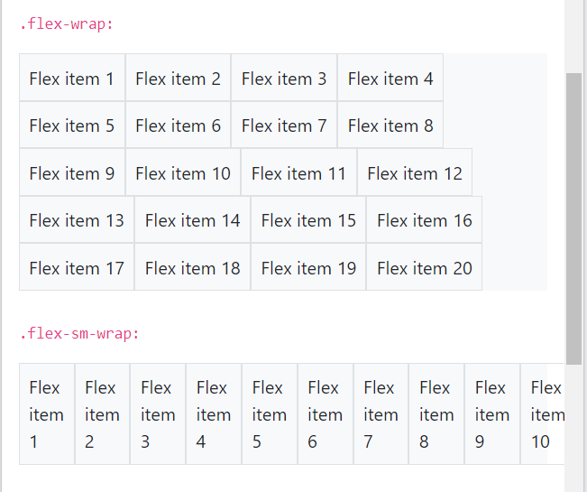

# 0. Content
  1. Bootstrap 4 Carousel
  2. Bootstrap 4 Modal
  3. Bootstrap 4 Tooltip
  4. Bootstrap 4 Popover
  5. Bootstrap 4 Toast
  6. Bootstrap 4 Scrollspy
  7. Bootstrap 4 Flex
  8. Bootstrap 4 Filters

# 1. Bootstrap 4 Carousel
## 1.1. Bootstrap Carousel
- `Carousel` là một trình chiếu để quay vòng qua các phần tử (các phần tử được lặp đi lặp lại theo 1 chu kỳ).

## 1.2. Cách tạo một carousel

  VD:
  ```html
  <style>
    /* Make the image fully responsive */
    .carousel-inner img {
      width: 100%;
      height: 100%;
    }
  </style>
  <div id="demo" class="carousel slide" data-ride="carousel">

    <!-- Indicators -->
    <ul class="carousel-indicators">
      <li data-target="#demo" data-slide-to="0" class="active"></li>
      <li data-target="#demo" data-slide-to="1"></li>
      <li data-target="#demo" data-slide-to="2"></li>
    </ul>
    
    <!-- The slideshow -->
    <div class="carousel-inner">
      <div class="carousel-item active">
        
      </div>
      <div class="carousel-item">
        
      </div>
      <div class="carousel-item">
        
      </div>
    </div>
    
    <!-- Left and right controls -->
    <a class="carousel-control-prev" href="#demo" data-slide="prev">
      <span class="carousel-control-prev-icon"></span>
    </a>
    <a class="carousel-control-next" href="#demo" data-slide="next">
      <span class="carousel-control-next-icon"></span>
    </a>
  </div>
  ```

- Giải thích các lớp được sử dụng trong ví dụ trên:
    - `.carousel`: được sử dụng để tạo một `carousel`
    - `.carousel-indicators`: được sử dụng để thêm chỉ số cho `carousel`. Sẽ có những dấu chấm nhỏ ở phía dưới của mỗi slide (số lượng dấu chấm tương đương với số slide có trong `carousel` và chỉ ra người dùng đang ở khung nhìn của slide nào).
    - `.carousel-inner`: dùng để thêm các slide tới `carousel`
    - `.carousel-item`: dùng để xác định nội dung của mỗi slide.
    - `.carousel-control-prev`: dùng để thêm một button bên trái (trước) cho `carousel`, button này cho phép người dùng quay lại slide trước đó
    - `.carousel-control-prev-icon`: sử dụng cùng với `.carousel-control-prev` để tạo button "trước"
    - `.carousel-control-next`: dùng để thêm một button bên phải (tiếp) cho `carousel`, button này cho phép người dùng xem slide tiếp theo trong `carousel`.
    - `.carousel-control-next-icon`: sử dụng cùng với `.carousel-control-next` để tạo button "tiếp"
    - `.slide`: Thêm hiệu ứng hoạt ảnh và chuyển tiếp CSS khi trượt từ mục này sang mục tiếp theo.

<p align = "center">

</p>

## 1.3. Thêm chú thích cho các trang slide
- Tạo chú thích bằng cách sau:
    - Thêm một phần tử `<div>` vào bên trong mỗi lớp `.carousel-item`. 
    - Sau đó thêm các phần tử chú thích vào bên trong phần tử `<div>` có lớp `.carousel-caption` này.

  VD:
  ```html
  <div id="demo" class="carousel slide" data-ride="carousel">
    <ul class="carousel-indicators">
      <li data-target="#demo" data-slide-to="0" class="active"></li>
      <li data-target="#demo" data-slide-to="1"></li>
      <li data-target="#demo" data-slide-to="2"></li>
    </ul>
    <div class="carousel-inner">
      <div class="carousel-item active">
        
        <div class="carousel-caption">
          <h3>Los Angeles</h3>
          <p>We had such a great time in LA!</p>
        </div>   
      </div>
      <div class="carousel-item">
        
        <div class="carousel-caption">
          <h3>Chicago</h3>
          <p>Thank you, Chicago!</p>
        </div>   
      </div>
      <div class="carousel-item">
        
        <div class="carousel-caption">
          <h3>New York</h3>
          <p>We love the Big Apple!</p>
        </div>   
      </div>
    </div>
    <a class="carousel-control-prev" href="#demo" data-slide="prev">
      <span class="carousel-control-prev-icon"></span>
    </a>
    <a class="carousel-control-next" href="#demo" data-slide="next">
      <span class="carousel-control-next-icon"></span>
    </a>
  </div>
  ```
<p align = "center">

</p>
<p align = "center">

</p>

# 2. Bootstrap 4 Modal
## 2.1. Bootstrap Modal
- Thành phần `Modal` là một hộp thoại (`popup`) được hiện thị phía trên của một trang web hiện tại. Trong `popup` có thể chứa rất nhiều thông tin khác nhau của 1 thành phần nào đó.
<p align = "center">

</p>

## 2.2. Cách tạo một Modal
  VD:
  ```html
  <button type="button" class="btn btn-primary" data-toggle="modal" data-target="#myModal">
      Open modal
  </button>

    <!-- The Modal -->
  <div class="modal fade" id="myModal">
      <div class="modal-dialog">
        <div class="modal-content">
        
          <!-- Modal Header -->
          <div class="modal-header">
            <h4 class="modal-title">Modal Heading</h4>
            <button type="button" class="close" data-dismiss="modal">&times;</button>
          </div>
          
          <!-- Modal body -->
          <div class="modal-body">
            Modal body..
          </div>
          
          <!-- Modal footer -->
          <div class="modal-footer">
            <button type="button" class="btn btn-danger" data-dismiss="modal">Close</button>
          </div>
          
      </div>
  </div>
```
**Giải thích:**
- Nút gọi popup:
    - `data-target="#myModal"` là dùng để xác định popup nào được gọi (nếu có nhiều popup trên cùng trang), trong ví dụ trên là popup có` id là #myModal`
    - `data-toggle="modal"` là lệnh mở một Modal Popup trong Bootstrap
    - Có thể sử dụng button hoặc thẻ `<a>` hoặc `<span>` để gọi popup nhưng phải luôn có 2 thuộc tính ở trên.
- Popup: được đặt trong phần tử chứa `<div>`
    - Phần tử chứa có `id="myModal"` dùng để xác định popup nào được gọi khi click button, lớp `.modal` xác định nội dung của popup
    - Lớp `.fade` là hiệu ứng chuyển động mở và đóng của popup với `fade in` và `fade out`.
    - Thuộc tính `role="dialog"` hiển thị popup dạng dialog
    - Lớp `.modal-content`: Nơi chứa nội dung chính hiển thị trong popup. Ở phần này có thể tùy chỉnh hoặc giữ nguyên mặc định nếu muốn (gồm 3 phần `.modal-header, .modal-body, .modal-footer`).
    - Thuộc tính `data-dismiss="modal"` là dùng để đóng `popup`. Để định dạng thành phần close popup, chúng ta có thể sử dụng `<button>`, `<a>` hoặc `<span>`. Tuy nhiên, **bắt buộc** phải có lệnh này để có thể đóng được popup. Ngoài ra, có thể thêm `class="close"` để sử dụng sẵn CSS của bootstrap cho thành phần này.

<p align = "center">

</p>

## 2.3. Kích thước của modal
-  Mặc định kích thước của modal là trung bình (`medium`)
- Thay đổi kích thước của modal bằng cách thêm lớp `.modal-sm` cho các modal nhỏ, lớp `.modal-lg` cho các modal lớn hoặc `.modal-xl` cho các modal cực lớn.
- Các lớp kích thước này sẽ được đặt vào trong thẻ `<div>` có tên lớp là `.modal-dialog`

VD:
- Modal nhỏ
  ```html
  <!-- The Modal -->
  <div class="modal fade" id="myModal">
      <div class="modal-dialog modal-sm">
        <div class="modal-content">
        
          <!-- Modal Header -->
          <div class="modal-header">
            <h4 class="modal-title">Modal Heading</h4>
            <button type="button" class="close" data-dismiss="modal">&times;</button>
          </div>
          
          <!-- Modal body -->
          <div class="modal-body">
            Modal body..
          </div>
          
          <!-- Modal footer -->
          <div class="modal-footer">
            <button type="button" class="btn btn-secondary" data-dismiss="modal">Close</button>
          </div>
        </div>
      </div>
  </div>
  ```
<p align = "center">

</p>

- Modal lớn
  ```html
  <!-- The Modal -->
  <div class="modal fade" id="myModal">
      <div class="modal-dialog modal-lg">
        <div class="modal-content">
        
          <!-- Modal Header -->
          <div class="modal-header">
            <h4 class="modal-title">Modal Heading</h4>
            <button type="button" class="close" data-dismiss="modal">&times;</button>
          </div>
          
          <!-- Modal body -->
          <div class="modal-body">
            Modal body..
          </div>
          
          <!-- Modal footer -->
          <div class="modal-footer">
            <button type="button" class="btn btn-secondary" data-dismiss="modal">Close</button>
          </div>
          
        </div>
      </div>
  </div>
  ```
<p align = "center">

</p>

## 2.4. Centerd Modal
- Để căn giữa `modal` theo chiều dọc và chiều ngang trong trang, sử dụng lớp `.modal-dialog-centered`, đặt lớp này vào trong thẻ `<div>` có tên lớp là `.modal-dialog`   

  VD:
  ```html
  <!-- The Modal -->
  <div class="modal fade" id="myModal">
      <div class="modal-dialog modal-dialog-centered">
          <div class="modal-content">
        
          <!-- Modal Header -->
          <div class="modal-header">
            <h4 class="modal-title">Modal Heading</h4>
            <button type="button" class="close" data-dismiss="modal">&times;</button>
          </div>
          
          <!-- Modal body -->
          <div class="modal-body">
            Modal body..
          </div>
          
          <!-- Modal footer -->
          <div class="modal-footer">
            <button type="button" class="btn btn-secondary" data-dismiss="modal">Close</button>
          </div>
          
          </div>
      </div>
  </div>
  ```
<p align = "center">

</p>

## 2.5. Scrolling Modal
- Khi có nhiều nội dung bên trong `modal`, một thanh cuộn sẽ được thêm vào trang để có thể xem được hết nội dung trong `popup`

  VD:
  ```html
  <!-- The Modal -->
  <div class="modal" id="myModal">
      <div class="modal-dialog">
          <div class="modal-content">
        
          <!-- Modal Header -->
          <div class="modal-header">
            <h1 class="modal-title">Modal Heading</h1>
            <button type="button" class="close" data-dismiss="modal">×</button>
          </div>
          
          <!-- Modal body -->
          <div class="modal-body">
            <h3>Some text to enable scrolling..</h3>
            <p>Some text to enable scrolling.. Lorem ipsum dolor sit amet, consectetur adipiscing elit, sed do eiusmod tempor incididunt ut labore et dolore magna aliqua. Ut enim ad minim veniam, quis nostrud exercitation ullamco laboris nisi ut aliquip ex ea commodo consequat. Duis aute irure dolor in reprehenderit in voluptate velit esse cillum dolore eu fugiat nulla pariatur. Excepteur sint occaecat cupidatat non proident, sunt in culpa qui officia deserunt mollit anim id est laborum consectetur adipiscing elit, sed do eiusmod tempor incididunt ut labore et dolore magna aliqua. Ut enim ad minim veniam, quis nostrud exercitation ullamco laboris nisi ut aliquip ex ea commodo consequat.</p>
            <p>Some text to enable scrolling.. Lorem ipsum dolor sit amet, consectetur adipiscing elit, sed do eiusmod tempor incididunt ut labore et dolore magna aliqua. Ut enim ad minim veniam, quis nostrud exercitation ullamco laboris nisi ut aliquip ex ea commodo consequat. Duis aute irure dolor in reprehenderit in voluptate velit esse cillum dolore eu fugiat nulla pariatur. Excepteur sint occaecat cupidatat non proident, sunt in culpa qui officia deserunt mollit anim id est laborum consectetur adipiscing elit, sed do eiusmod tempor incididunt ut labore et dolore magna aliqua. Ut enim ad minim veniam, quis nostrud exercitation ullamco laboris nisi ut aliquip ex ea commodo consequat.</p>
          </div>
          
          <!-- Modal footer -->
          <div class="modal-footer">
            <button type="button" class="btn btn-danger" data-dismiss="modal">Close</button>
          </div>
          </div>
      </div>
  </div>
  ```
<p align = "center">

</p>

- Chúng ta cũng có thể sử dụng lớp `.modal-dialog-scrollable` đặt cùng lớp `.modal-dialog` để tạo thanh cuộn chỉ cho phần `.modal-body` bên trong nội dung của `popup` chứ không phải thanh cuộn cho cả `popup` như ví dụ bên trên.  

  ```html
  <!-- The Modal -->
  <div class="modal" id="myModal">
      <div class="modal-dialog modal-dialog-scrollable">
          <div class="modal-content">
        
          <!-- Modal Header -->
          <div class="modal-header">
            <h1 class="modal-title">Modal Heading</h1>
            <button type="button" class="close" data-dismiss="modal">×</button>
          </div>
          
          <!-- Modal body -->
          <div class="modal-body">
            <h3>Some text to enable scrolling..</h3>
            <p>Some text to enable scrolling.. Lorem ipsum dolor sit amet, consectetur adipiscing elit, sed do eiusmod tempor incididunt ut labore et dolore magna aliqua. Ut enim ad minim veniam, quis nostrud exercitation ullamco laboris nisi ut aliquip ex ea commodo consequat. Duis aute irure dolor in reprehenderit in voluptate velit esse cillum dolore eu fugiat nulla pariatur. Excepteur sint occaecat cupidatat non proident, sunt in culpa qui officia deserunt mollit anim id est laborum consectetur adipiscing elit, sed do eiusmod tempor incididunt ut labore et dolore magna aliqua. Ut enim ad minim veniam, quis nostrud exercitation ullamco laboris nisi ut aliquip ex ea commodo consequat.</p>
            <p>Some text to enable scrolling.. Lorem ipsum dolor sit amet, consectetur adipiscing elit, sed do eiusmod tempor incididunt ut labore et dolore magna aliqua. Ut enim ad minim veniam, quis nostrud exercitation ullamco laboris nisi ut aliquip ex ea commodo consequat. Duis aute irure dolor in reprehenderit in voluptate velit esse cillum dolore eu fugiat nulla pariatur. Excepteur sint occaecat cupidatat non proident, sunt in culpa qui officia deserunt mollit anim id est laborum consectetur adipiscing elit, sed do eiusmod tempor incididunt ut labore et dolore magna aliqua. Ut enim ad minim veniam, quis nostrud exercitation ullamco laboris nisi ut aliquip ex ea commodo consequat.</p>
          </div>
          
          <!-- Modal footer -->
          <div class="modal-footer">
            <button type="button" class="btn btn-danger" data-dismiss="modal">Close</button>
          </div>
          </div>
      </div>
  </div>
  ```
<p align = "center">

</p>

# 3. Bootstrap 4 Tooltip
## 3.1. Bootstrap Tooltip
- Tooltip (công cụ chú thích) là một hộp `popup` nhỏ xuất hiện khi người dùng di chuột qua một phần tử
<p align = "center">

</p>

## 3.2. Cách tạo một tooltip
- Để tạo một `tooltip`, chúng ta thêm thuộc tính `data-toggle="tooltip"` vào một phần tử
- Sử dụng thuộc tính `title` để chỉ định văn bản sẽ được hiển thị bên trong `tooltip`.
- Lưu ý: `Tooltip` phải được khởi tạo bằng jQuery: chọn phần tử đã chỉ định và gọi phương thức `tooltip()` (chúng ta sẽ học kỹ hơn ở phần Javascript)

  VD:
  ```html
  <div class="container">
    <h3>Tooltip Example</h3>
    <a href="#" class="tool" data-toggle="tooltip" title="Hooray!">Hover over me</a>
  </div>

  <script>
    $(document).ready(function(){
      $('[class="tool"]').tooltip();   
    });
  </script>
  ```
<p align = "center">

</p>

## 3.3. Positioning Tooltips
- Mặc định, `tooltip` sẽ xuất hiện ở phía trên của phần tử
- Chúng ta có thể thiết lập vị trí khác cho `tooltip` bằng cách sử dụng thuộc tính `data-placement` với các giá trị: `top, bottom, left, right`.  

  VD:
  ```html
  <div class="container">
    <a href="#" data-toggle="tooltip" data-placement="top" title="Hooray!">Top</a>
    <a href="#" data-toggle="tooltip" data-placement="bottom" title="Hooray!">Bottom</a>
    <a href="#" data-toggle="tooltip" data-placement="left" title="Hooray!">Left</a>
    <a href="#" data-toggle="tooltip" data-placement="right" title="Hooray!">Right</a>
  </div>

  <script>
  $(document).ready(function(){
    $('[data-toggle="tooltip"]').tooltip();   
  });
  </script>
  ```
<p align = "center">

</p>

# 4. Bootstrap 4 Popover
## 4.1. Bootstrap 4 Popover
- `Popover` là một hộp `popup` mà xuất hiện khi người dùng click vào một phần tử. 
- `Popover` có thể chứa được nhiều nội dung trong hộp `popup`

<p align = "center">

</p>

## 4.2. Cách tạo một popover
- Để tạo một `popover`, chúng ta thêm thuộc tính `data-toggle="popover`" vào một phần tử.
- Sử dụng thuộc tính `title` để `chỉ định tiêu đề` của popover, và sử dụng thuộc tính `data-content` để `chỉ định nội dung` sẽ được hiển thị bên trong phần thân của `popover`.
- *Lưu ý*: `Popover` phải được khởi tạo bằng jQuery: chọn phần tử đã chỉ định và gọi phương thức `popover()`.  

  VD:
  ```html
  <div class="container">
    <h3>Popover Example</h3>
    <a href="#" data-toggle="popover" title="Popover Header" data-content="Some content inside the popover">Toggle popover</a>
  </div>

  <script>
  $(document).ready(function(){
    $('[data-toggle="popover"]').popover();   
  });
  </script>
  ```
<p align = "center">

</p>

## 4.4. Positioning Popovers
- Mặc định, `popover` sẽ xuất hiện ở phía bên phải của phần tử
- Chúng ta có thể thiết lập vị trí khác cho `popover` bằng cách sử dụng thuộc tính `data-placement` với các giá trị: `top, bottom, left, right`.   

  VD:
  ```html
  <div class="container">
    <h3>Popover Example</h3>
    <a href="#" title="Header" data-toggle="popover" data-placement="top" data-content="Content">Top</a>
    <a href="#" title="Header" data-toggle="popover" data-placement="bottom" data-content="Content">Bottom</a>
    <a href="#" title="Header" data-toggle="popover" data-placement="left" data-content="Content">Left</a>
    <a href="#" title="Header" data-toggle="popover" data-placement="right" data-content="Content">Right</a>
  </div>

  <script>
  $(document).ready(function(){
    $('[data-toggle="popover"]').popover();   
  });
  </script>
  ```
<p align = "center">

</p>

- *Lưu ý*: Thuộc tính vị trí không hoạt động như mong đợi nếu không đủ chỗ cho chúng hiển thị.  
Ví dụ: nếu sử dụng vị trí trên cùng ở đầu trang (nơi không có chỗ hiển thị cho nó), thay vào đó, nó sẽ hiển thị `popover` bên dưới hoặc ở bên phải phần tử (bất cứ nơi nào có chỗ cho nó).

## 4.5. Closing Popover
- Mặc định, `popover` sẽ được đóng lại khi chúng ta click vào phần tử chứa nó một lần nữa. 
- Tuy nhiên chúng ta có thể sử dụng thuộc tính `data-trigger="focus"` để có thể đóng `popover` lại khi click vào bất cứ đâu ngoài phần tử chứa nó   

  VD:
  ```html
  <div class="container">
    <h3>Popover Example</h3>
      <a href="#" title="Dismissible popover" data-toggle="popover" data-trigger="focus" data-content="Click anywhere in the document to close this popover">Click me</a>
  </div>

  <script>
  $(document).ready(function(){
    $('[data-toggle="popover"]').popover();   
  });
  </script>
  ```
- Lưu ý: Nếu chúng ta muốn `popover` được hiển thị khi di chuột qua phần tử giống như `tooltip`, thì có thể sử dụng thuộc tính `data-trigger="hover"`.  

  VD:
  ```html
  <a href="#" title="Header" data-toggle="popover" data-trigger="hover" data-content="Some content">Hover over me</a>
  ```

# 5. Bootstrap 4 Toast
## 5.1. Bootstrap Toast
- `Toast` giống như là một hộp cảnh báo nhưng nó chỉ hiển thị trong 1 vài giây khi điều gì đó xảy ra (vd khi người dùng click vào 1 button, nộp một biểu mẫu,...)

<p align = "center">

</p>

## 5.2. Cách tạo một toast
- Để tạo một `toast`, chúng ta sử dụng một phần tử chứa với tên lớp là `.toast`. Sau đó thêm các phần tử với lớp `.toast-header` và `.toast-body` vào trong phần tử `.toast`   
- *Lưu ý:* `Toast` phải được khởi tạo với jQuery: chọn phần tử đã chỉ định và gọi phương thức `toast()`.  

  VD:
  ```html
  <button type="button" class="btn btn-primary" id="myBtn">Show Toast</button>

    <div class="toast">
      <div class="toast-header">
        Toast Header
      </div>
      <div class="toast-body">
        Some text inside the toast body
      </div>
    </div>
  </div>

  <script>
  $(document).ready(function(){
    $("#myBtn").click(function(){
      $('.toast').toast('show');
    });
  });
  </script>
  ```
<p align = "center">

</p>

## 5.3. Hiển thị và ẩn một toast
- Mặc định, một `toast` sẽ được ẩn đi. Có thể chuyển sang chế độ mặc định là hiển thị bằng cách sử dụng thuộc tính `data-autohide="false"`
- Để đóng `toast`, sử dụng một button với thuộc tính `data-dismiss="toast"`  

  VD:
  ```html
  <div class="toast" data-autohide="false">
      <div class="toast-header">
        <strong class="mr-auto text-primary">Toast Header</strong>
        <small class="text-muted">5 mins ago</small>
        <button type="button" class="ml-2 mb-1 close" data-dismiss="toast">&times;</button>
      </div>
      <div class="toast-body">
        Some text inside the toast body
      </div>
    </div>
  </div>

  <script>
  $(document).ready(function(){
    $('.toast').toast('show');
  });
  </script>
  ```
<p align = "center">

</p>

# 6. Bootstrap 4 Scrollspy
## 6.1. Bootstrap Scrollspy
- `Scrollspy` được sử dụng để tự động cập nhật các liên kết trong danh sách điều hướng dựa trên vị trí cuộn (khi thanh cuộn đến nội dung của liên kết nào, thì trên thanh điều hướng cũng tự động chuyển sang liên kết đó).

## 6.2. Cách tạo một Scrollspy

VD
  ```html
  <style>
  body {
      position: relative; 
  }
  </style>

  <body data-spy="scroll" data-target=".navbar" data-offset="50">

  <nav class="navbar navbar-expand-sm bg-dark navbar-dark fixed-top">  
    <ul class="navbar-nav">
      <li class="nav-item">
        <a class="nav-link" href="#section1">Section 1</a>
      </li>
      <li class="nav-item">
        <a class="nav-link" href="#section2">Section 2</a>
      </li>
      <li class="nav-item">
        <a class="nav-link" href="#section3">Section 3</a>
      </li>
      <li class="nav-item ">
        <a class="nav-link"  href="#section4">
          Section 4
        </a>
      </li>
    </ul>
  </nav>

  <div id="section1" class="container-fluid bg-success" style="padding-top:70px;padding-bottom:70px">
    <h1>Section 1</h1>
    <p>Try to scroll this section and look at the navigation bar while scrolling! Try to scroll this section and look at the navigation bar while scrolling!</p> 
  </div>
  <div id="section2" class="container-fluid bg-warning" style="padding-top:70px;padding-bottom:70px">
    <h1>Section 2</h1>
    <p>Try to scroll this section and look at the navigation bar while scrolling! Try to scroll this section and look at the navigation bar while scrolling!</p>
  </div>
  <div id="section3" class="container-fluid bg-secondary" style="padding-top:70px;padding-bottom:70px">
    <h1>Section 3</h1>
    <p>Try to scroll this section and look at the navigation bar while scrolling! Try to scroll this section and look at the navigation bar while scrolling!</p>
  </div>
  <div id="section4" class="container-fluid bg-primary" style="padding-top:70px;padding-bottom:70px">
    <h1>Section 4</h1>
    <p>Try to scroll this section and look at the navigation bar while scrolling! Try to scroll this section and look at the navigation bar while scrolling!</p>
  </div>
  </body>
  ```
- Giải thích:
  - Thêm thuộc tính `data-spy="scroll"` vào phần tử được sử dụng làm khu vực có thể cuộn (thường phần này là `<body>`)
  - Sau đó thêm thuộc tính `data-target` với `một giá trị là tên id hoặc tên class` của thanh điều hướng (`.navbar`). Điều này đảm bảo rằng thanh điều hướng đã được kết nối với khu vực cuộn
  - Những phần tử có thể cuộn `phải có id trùng với id của các liên kết` bên trong các danh mục danh sách điều hướng (VD `<div id="section1">` trùng với `<a href="#section1">`).  


  - *Lưu ý yêu cầu*: Phần tử có `data-spy="scroll"` yêu cầu thuộc tính `position` CSS, với giá trị "`relative`" để hoạt động bình thường.   

    ```css
    body {
        position: relative; 
    }
    ```
<p align = "center">

</p>

## 6.3. Scrollspy Vertical Menu
 
VD:
  ```html
  <style>
  body {
    position: relative;
  }
  ul.nav-pills {
    top: 20px;
    position: fixed;
  }
  div.col-8 div {
    height: 500px;
  }
  </style>

  <body data-spy="scroll" data-target="#myScrollspy" data-offset="1">

  <div class="container-fluid">
    <div class="row">
      <nav class="col-sm-3 col-4" id="myScrollspy">
        <ul class="nav nav-pills flex-column">
          <li class="nav-item">
            <a class="nav-link active" href="#section1">Section 1</a>
          </li>
          <li class="nav-item">
            <a class="nav-link" href="#section2">Section 2</a>
          </li>
          <li class="nav-item">
            <a class="nav-link" href="#section3">Section 3</a>
          </li>
          <li class="nav-item dropdown">
            <a class="nav-link dropdown-toggle" data-toggle="dropdown" href="#">Section 4</a>
            <div class="dropdown-menu">
              <a class="dropdown-item" href="#section41">Link 1</a>
              <a class="dropdown-item" href="#section42">Link 2</a>
            </div>
          </li>
        </ul>
      </nav>
      <div class="col-sm-9 col-8">
        <div id="section1" class="bg-success">    
          <h1>Section 1</h1>
          <p>Try to scroll this section and look at the navigation list while scrolling!</p>
        </div>
        <div id="section2" class="bg-warning"> 
          <h1>Section 2</h1>
          <p>Try to scroll this section and look at the navigation list while scrolling!</p>
        </div>        
        <div id="section3" class="bg-secondary">         
          <h1>Section 3</h1>
          <p>Try to scroll this section and look at the navigation list while scrolling!</p>
        </div>
        <div id="section41" class="bg-danger">         
          <h1>Section 4-1</h1>
          <p>Try to scroll this section and look at the navigation list while scrolling!</p>
        </div>      
        <div id="section42" class="bg-info">         
          <h1>Section 4-2</h1>
          <p>Try to scroll this section and look at the navigation list while scrolling!</p>
        </div>
      </div>
    </div>
  </div>
  </body>
  ```
<p align = "center">

</p>

# 7. Bootstrap 4 Flex
- Sử dụng các lớp flex để thay đổi bố cục của các thành phần Bootstrap 4

## 7.1. Flexbox
- Module bố cục Flexbox làm cho việc thiết kế cấu trúc bố cục linh hoạt trở nên dễ dàng hơn mà không sử dụng các thuộc tính float và position.
- Để tạo một hộp chứa flexbox và chuyển các phần tử con trực tiếp thành các phần tử flex, hãy sử dụng lớp `.d-flex `  

  VD:
  ```html
  <h2>Flex</h2>
  <div class="d-flex p-3 bg-secondary text-white">  
    <div class="p-2 bg-info">Flex item 1</div>
    <div class="p-2 bg-warning">Flex item 2</div>
    <div class="p-2 bg-primary">Flex item 3</div>
  </div>
  ```
<p align = "center">

</p>

- Để tạo một phần tử chứa flexbox nội tuyến, chúng ta sử dụng lớp `.d-inline-flex`   

  VD:
  ```html
  <h2>Inline Flex</h2>
  <div class="d-inline-flex p-3 bg-secondary text-white">  
    <div class="p-2 bg-info">Flex item 1</div>
    <div class="p-2 bg-warning">Flex item 2</div>
    <div class="p-2 bg-primary">Flex item 3</div>
  </div>
  ```
<p align = "center">

</p>

## 7.2. Horizontal Direction
- Sử dụng lớp `.flex-row` để hiển thị các phần tử flex theo hướng nằm ngang. Đây là thiết lập mặc định.
- Chúng ta cũng có thể sử dụng lớp `.flex-row-reverse` để đảo ngược các phần tử flex theo hướng nằm ngang.   

  VD:
  ```html
  <h2>Horizontal Direction</h2>
  <p>Use .flex-row (default):</p>
  <div class="d-flex flex-row bg-secondary mb-3">
    <div class="p-2 bg-info">Flex item 1</div>
    <div class="p-2 bg-warning">Flex item 2</div>
    <div class="p-2 bg-primary">Flex item 3</div>
  </div>
  <p>Use .flex-row-reverse to right-align the direction:</p>
  <div class="d-flex flex-row-reverse bg-secondary">
    <div class="p-2 bg-info">Flex item 1</div>
    <div class="p-2 bg-warning">Flex item 2</div>
    <div class="p-2 bg-primary">Flex item 3</div>
  </div>
  ```
<p align = "center">

</p>

## 7.3. Vertical Direction
- Sử dụng `.flex-column` để hiển thị các phần tử flex theo chiều dọc (chồng lên nhau) hoặc `.flex-column-reverse` để đảo ngược các phần tử theo hướng dọc.   

  VD:
  ```html
  <h2>Vertical Direction</h2>
  <p>Use .flex-column:</p>
  <div class="d-flex flex-column mb-3">
    <div class="p-2 bg-info">Flex item 1</div>
    <div class="p-2 bg-warning">Flex item 2</div>
    <div class="p-2 bg-primary">Flex item 3</div>
  </div>
  <p>Use .flex-column-reverse to reverse the vertical direction:</p>
  <div class="d-flex flex-column-reverse">
    <div class="p-2 bg-info">Flex item 1</div>
    <div class="p-2 bg-warning">Flex item 2</div>
    <div class="p-2 bg-primary">Flex item 3</div>
  </div>
  ```
<p align = "center">

</p>

## 7.4. Justify Content
- Sử dụng các lớp `.justify-content-*` để thay đổi căn chỉnh của các phần tử flex:
  - `justify-content-start`: các phần tử flex được căn chỉnh ở bên trái
  - `justify-content-end`: các phần tử flex được căn chỉnh ở bên phải
  - `justify-content-cnter`: các phần tử flex được căn chỉnh ở giữa
  - `justify-content-between`: các phần tử flex được căn chỉnh sao cho khoảng cách giữa các phần tử flex đều bằng nhau, và 2 phần tử flex ở đầu và cuối sẽ nằm sát ở 2 bên trái - phải.
  - `justify-content-around`: các phần tử flex được căn chỉnh sao cho khoảng cách giữa các phần tử flex đều bằng nhau, và khoảng cách từ 2 phía trái-phải đến phần tử flex đầu-cuối bằng một nửa khoảng cách giữa 2 phần tử liền kề nhau.   

  VD:
  ```html
  <h2> justify-content-start:</h2>
  <div class="d-flex justify-content-start bg-secondary mb-3">
    <div class="p-2 bg-info">Flex item 1</div>
    <div class="p-2 bg-warning">Flex item 2</div>
    <div class="p-2 bg-primary">Flex item 3</div>
  </div>
  <h2> justify-content-end:</h2>
  <div class="d-flex justify-content-end bg-secondary mb-3">
    <div class="p-2 bg-info">Flex item 1</div>
    <div class="p-2 bg-warning">Flex item 2</div>
    <div class="p-2 bg-primary">Flex item 3</div>
  </div>
  <h2> justify-content-center:</h2>
  <div class="d-flex justify-content-center bg-secondary mb-3">
    <div class="p-2 bg-info">Flex item 1</div>
    <div class="p-2 bg-warning">Flex item 2</div>
    <div class="p-2 bg-primary">Flex item 3</div>
  </div>
  <h2> justify-content-between:</h2>
  <div class="d-flex justify-content-between bg-secondary mb-3">
    <div class="p-2 bg-info">Flex item 1</div>
    <div class="p-2 bg-warning">Flex item 2</div>
    <div class="p-2 bg-primary">Flex item 3</div>
  </div>
  <h2> justify-content-around:</h2>
  <div class="d-flex justify-content-around bg-secondary mb-3">
    <div class="p-2 bg-info">Flex item 1</div>
    <div class="p-2 bg-warning">Flex item 2</div>
    <div class="p-2 bg-primary">Flex item 3</div>
  </div>
  ```
<p align = "center">

</p>

## 7.5. Fill/Equal widths
- Sử dụng lớp `.flex-fill` cho các phần tử flex để thiết lập cho các phần tử đó có kích thước chiều rộng bằng nhau:  

  VD:
  ```html
  <div class="d-flex">
    <div class="p-2 bg-info flex-fill">Flex item 1</div>
    <div class="p-2 bg-warning flex-fill">Flex item 2</div>
    <div class="p-2 bg-primary flex-fill">Flex item 3</div>
  </div>
  ```
<p align = "center">

</p>

## 7.6. Grow
- Sử dụng lớp `.flex-grow-1` cho một phần tử flex để thiết lập cho nó có chiều rộng bằng với khoảng trống còn lại của phần tử chứa.  

  VD: hai mục flex đầu tiên chiếm không gian cần thiết của chúng, trong khi mục cuối cùng chiếm phần còn lại của không gian có sẵn
  ```html
  <div class="d-flex">
    <div class="p-2 bg-info">Flex item 1</div>
    <div class="p-2 bg-warning">Flex item 2</div>
    <div class="p-2 bg-primary flex-grow-1">Flex item 3</div>
  </div>
  ```
<p align = "center">

</p>

- Chúng ta có thể sử dụng `.flex-shrink-1` trên một mục flex để làm cho nó co lại nếu cần.  

  VD:
  ```html
  <p>Use .flex-shrink-1 on a flex item 3:</p>
  <div class="d-flex mb-3">
    <div class="p-2 bg-info">Flex item 1</div>
    <div class="p-2 bg-warning">Flex item 2</div>
    <div class="p-2 flex-shrink-1 bg-primary">Flex item 3</div>
  </div>
  <p>Example default:</p>
  <div class="d-flex mb-3 bg-secondary">
    <div class="p-2 bg-info">Flex item 1</div>
    <div class="p-2 bg-warning">Flex item 2</div>
    <div class="p-2 bg-primary">Flex item 3</div>
  </div>
  ```
<p align = "center">

</p>

## 7.7. Order
- Thay đổi thứ tự hiển thị của các phần tử flex cụ thể bằng các lớp `.order-*`. Biểu tượng `*` có giá trị từ 0 đến 12, trong đó `số thấp nhất có mức độ ưu tiên cao nhất` (thứ tự 1 được hiển thị trước thứ tự 2,...)   

  VD:
  ```html
  <div class="d-flex bg-secondary">
    <div class="p-2 bg-info order-3">Flex item 1</div>
    <div class="p-2 bg-warning order-2">Flex item 2</div>
    <div class="p-2 bg-primary order-1">Flex item 3</div>
  </div>
  ```
<p align = "center">

</p>

## 7.8. Auto Margins
- Dễ dàng thêm `margin` tự động cho các phần tử flex bằng `.mr-auto` (đẩy các mục sang phải) hoặc bằng cách sử dụng `.ml-auto` (đẩy các mục sang trái)   

  VD:

  ```html
  <div class="d-flex bg-secondary">
    <div class="p-2 mr-auto bg-info">Flex item 1</div>
    <div class="p-2 bg-warning">Flex item 2</div>
    <div class="p-2 bg-primary">Flex item 3</div>
  </div>

  <div class="d-flex bg-secondary">
    <div class="p-2 bg-info">Flex item 1</div>
    <div class="p-2 bg-warning">Flex item 2</div>
    <div class="p-2 ml-auto bg-primary">Flex item 3</div>
  </div>
  ```
<p align = "center">

</p>

## 7.9. Wrap
- Kiểm soát cách bọc các phần tử flex trong hộp chứa flex bằng các lớp:
  - `.flex-nowrap`: (mặc định)- các phần tử hiển thị trên cùng 1 hàng trong phần tử chứa
  - `.flex-wrap`: các phần tử được ngắt xuống dòng khi cần thiết
  - `.flex-wrap-reverse`: các phần tử được hiển thị ngược lại từ dưới lên so với `.flex-wrap` 

  VD:
  - `.flex-wrap`:

    ```html
    <p><code>.flex-wrap:</code></p>
    <div class="d-flex flex-wrap bg-light">
      <div class="p-2 border">Flex item 1</div>
      <div class="p-2 border">Flex item 2</div>
      <div class="p-2 border">Flex item 3</div>
      <div class="p-2 border">Flex item 4</div>
      <div class="p-2 border">Flex item 5</div>
      <div class="p-2 border">Flex item 6</div>
      <div class="p-2 border">Flex item 7</div>
      <div class="p-2 border">Flex item 8</div>
      <div class="p-2 border">Flex item 9</div>
      <div class="p-2 border">Flex item 10</div>
    </div>
    ```
  <p align = "center">
  
  </p>

  - `.flex-wrap-reverse`:

    ```html
    <p><code>.flex-wrap-reverse:</code></p>
    <div class="d-flex flex-wrap-reverse bg-light">
      <div class="p-2 border">Flex item 1</div>
      <div class="p-2 border">Flex item 2</div>
      <div class="p-2 border">Flex item 3</div>
      <div class="p-2 border">Flex item 4</div>
      <div class="p-2 border">Flex item 5</div>
      <div class="p-2 border">Flex item 6</div>
      <div class="p-2 border">Flex item 7</div>
      <div class="p-2 border">Flex item 8</div>
      <div class="p-2 border">Flex item 9</div>
      <div class="p-2 border">Flex item 10</div>
    </div>
    ```
  <p align = "center">
  
  </p>

  - `.flex-nowrap`:

    ```html
    <p><code>.flex-nowrap:</code></p>
    <div class="d-flex flex-nowrap bg-light">
      <div class="p-2 border">Flex item 1</div>
      <div class="p-2 border">Flex item 2</div>
      <div class="p-2 border">Flex item 3</div>
      <div class="p-2 border">Flex item 4</div>
      <div class="p-2 border">Flex item 5</div>
      <div class="p-2 border">Flex item 6</div>
      <div class="p-2 border">Flex item 7</div>
      <div class="p-2 border">Flex item 8</div>
      <div class="p-2 border">Flex item 9</div>
      <div class="p-2 border">Flex item 10</div>
    </div>
    ```
  <p align = "center">
  
  </p>

## 7.10. Align Content
- Kiểm soát căn chỉnh theo chiều dọc của các phần tử flex được xác định bằng các lớp sau:
  - `.align-content-start`: (mặc định) - các phần tử flex được căn chỉnh ở phía trên của phần tử chứa
  - `.align-content-end`: - các phần tử flex được căn chỉnh ở phía dưới của phần tử chứa
  - `.align-content-center`: - các phần tử flex được căn chỉnh ở giữa của phần tử chứa
  - `.align-content-between`: các phần tử flex được căn chỉnh theo chiều dọc sao cho khoảng cách giữa các dòng chứa phần tử flex đều bằng nhau, và 2 dòng phần tử flex ở đầu và cuối sẽ nằm sát ở 2 phía trên và dưới của phần tử chứa flex.
  - `.align-content-around`: các phần tử flex được căn chỉnh sao cho khoảng cách giữa các dòng chứa phần tử flex đều bằng nhau, và khoảng cách từ 2 phía trên-dưới đến dòng chứa phần tử flex đầu-cuối bằng một nửa khoảng cách giữa 2 dòng chứa phần tử liền kề nhau. 
  - `.align-content-stretch`: Tất cả các phần tử flex được căn chỉnh kéo dãn sao cho có chiều cao đều bằng nhau và lấp đầy khoảng không gian theo chiều dọc của phần tử chứa.   

  VD: 

- `.align-content-center`

  ```html
    <p>.align-content-center:</p>
    <div class="d-flex flex-wrap align-content-center bg-light" style="height:300px">
      <div class="p-2 border">Flex item 1</div>
      <div class="p-2 border">Flex item 2</div>
      <div class="p-2 border">Flex item 3</div>
      <div class="p-2 border">Flex item 4</div>
      <div class="p-2 border">Flex item 5</div>
      <div class="p-2 border">Flex item 6</div>
      <div class="p-2 border">Flex item 7</div>
      <div class="p-2 border">Flex item 8</div>
      <div class="p-2 border">Flex item 9</div>
      <div class="p-2 border">Flex item 10</div>
      <div class="p-2 border">Flex item 11</div>
      <div class="p-2 border">Flex item 12</div>
      <div class="p-2 border">Flex item 13 </div>
      <div class="p-2 border">Flex item 14</div>
      <div class="p-2 border">Flex item 15</div>
      <div class="p-2 border">Flex item 16</div>
      <div class="p-2 border">Flex item 17</div>
      <div class="p-2 border">Flex item 18</div>
      <div class="p-2 border">Flex item 19</div>
      <div class="p-2 border">Flex item 20</div>
    </div>
    ```
<p align = "center">

</p>

- `.align-content-around`

  ```html
  <p>.align-content-around:</p>
  <div class="d-flex flex-wrap align-content-around bg-light" style="height:300px">
    <div class="p-2 border">Flex item 1</div>
    <div class="p-2 border">Flex item 2</div>
    <div class="p-2 border">Flex item 3</div>
    <div class="p-2 border">Flex item 4</div>
    <div class="p-2 border">Flex item 5</div>
    <div class="p-2 border">Flex item 6</div>
    <div class="p-2 border">Flex item 7</div>
    <div class="p-2 border">Flex item 8</div>
    <div class="p-2 border">Flex item 9</div>
    <div class="p-2 border">Flex item 10</div>
    <div class="p-2 border">Flex item 11</div>
    <div class="p-2 border">Flex item 12</div>
    <div class="p-2 border">Flex item 13 </div>
    <div class="p-2 border">Flex item 14</div>
    <div class="p-2 border">Flex item 15</div>
    <div class="p-2 border">Flex item 16</div>
    <div class="p-2 border">Flex item 17</div>
    <div class="p-2 border">Flex item 18</div>
    <div class="p-2 border">Flex item 19</div>
    <div class="p-2 border">Flex item 20</div>
  </div>
  ```
<p align = "center">

</p>

- `.align-content-stretch`

  ```html
  <p>.align-content-stretch:</p>
  <div class="d-flex flex-wrap align-content-stretch bg-light" style="height:300px">
    <div class="p-2 border">Flex item 1</div>
    <div class="p-2 border">Flex item 2</div>
    <div class="p-2 border">Flex item 3</div>
    <div class="p-2 border">Flex item 4</div>
    <div class="p-2 border">Flex item 5</div>
    <div class="p-2 border">Flex item 6</div>
    <div class="p-2 border">Flex item 7</div>
    <div class="p-2 border">Flex item 8</div>
    <div class="p-2 border">Flex item 9</div>
    <div class="p-2 border">Flex item 10</div>
    <div class="p-2 border">Flex item 11</div>
    <div class="p-2 border">Flex item 12</div>
    <div class="p-2 border">Flex item 13 </div>
    <div class="p-2 border">Flex item 14</div>
    <div class="p-2 border">Flex item 15</div>
    <div class="p-2 border">Flex item 16</div>
    <div class="p-2 border">Flex item 17</div>
    <div class="p-2 border">Flex item 18</div>
    <div class="p-2 border">Flex item 19</div>
    <div class="p-2 border">Flex item 20</div>
  </div>
  ```
<p align = "center">

</p>

## 7.11. Align Items
- Kiểm soát căn chỉnh theo chiều dọc của các hàng đơn lẻ của các phần tử flex với các lớp sau:
  - `.align-items-start`
  - `.align-items-end`
  - `.align-items-center`
  - `.align-items-baseline`
  - `.align-items-stretch` (mặc định).   

  VD:
  - `.align-items-start`

    ```html
    <div class="d-flex align-items-start bg-light" style="height:150px">
      <div class="p-2 border">Flex item 1</div>
      <div class="p-2 border">Flex item 2</div>
      <div class="p-2 border">Flex item 3</div>
    </div>
    ```
  <p align = "center">
  
  </p>

  - `.align-items-end`

    ```html
    <div class="d-flex align-items-end bg-light" style="height:150px">
      <div class="p-2 border">Flex item 1</div>
      <div class="p-2 border">Flex item 2</div>
      <div class="p-2 border">Flex item 3</div>
    </div>
    ```
  <p align = "center">
  
  </p>

  - `.align-items-baseline`

    ```html
    <div class="d-flex align-items-baseline bg-light" style="height:150px">
      <div class="p-2 border">Flex item 1</div>
      <div class="p-2 border">Flex item 2</div>
      <div class="p-2 border">Flex item 3</div>
    </div>
    ```
  <p align = "center">
  
  </p>

  - `.align-items-stretch`

    ```html
    <div class="d-flex align-items-stretch bg-light" style="height:150px">
      <div class="p-2 border">Flex item 1</div>
      <div class="p-2 border">Flex item 2</div>
      <div class="p-2 border">Flex item 3</div>
    </div>
    ```
  <p align = "center">
  
  </p>

## 7.12. Align Self
- Kiểm soát căn chỉnh theo chiều dọc cho một phần tử flex cụ thể với các lớp sau:
  - `.align-self-start`
  - `.align-self-end`
  - .`align-self-center`
  - `.align-self-baseline`
  - `.align-self-stretch` (mặc định).   

  VD:
  - `.align-self-start`

    ```html
    <div class="d-flex bg-light" style="height:150px">
      <div class="p-2 border">Flex item 1</div>
      <div class="p-2 border align-self-start">Flex item 2</div>
      <div class="p-2 border">Flex item 3</div>
    </div>
    ```
  <p align = "center">
  
  </p>

  - `.align-self-end`

    ```html
    <div class="d-flex bg-light" style="height:150px">
      <div class="p-2 border">Flex item 1</div>
      <div class="p-2 border align-self-end">Flex item 2</div>
      <div class="p-2 border">Flex item 3</div>
    </div>
    ```
  <p align = "center">
  
  </p>

  - `.align-self-baseline`  

    ```html
    <div class="d-flex bg-light" style="height:150px">
      <div class="p-2 border">Flex item 1</div>
      <div class="p-2 border align-self-baseline">Flex item 2</div>
      <div class="p-2 border">Flex item 3</div>
    </div>
    ```
  <p align = "center">
  
  </p>

  - `.align-self-stretch`

    ```html
    <div class="d-flex bg-light" style="height:150px">
      <div class="p-2 border">Flex item 1</div>
      <div class="p-2 border align-self-stretch">Flex item 2</div>
      <div class="p-2 border">Flex item 3</div>
    </div>
    ```
  <p align = "center">
  
  </p>

## 7.12. Responsive Flex Classes
- Tất cả các lớp flex đều đi kèm với các lớp linh hoạt bổ sung, giúp dễ dàng thiết lập một lớp flex cụ thể trên một kích thước màn hình cụ thể.  
VD: `.d-*-flex, .flex-*-row-reverse, .justify-content-*-end, .flex-*-grow-1,` ...

- Trong đó biểu tượng `*` có thể được thay thế bằng các giá trị sau:
  - `sm`: đại diện cho màn hình nhỏ, áp dụng khi màn hình > 576px
  - `md`: đại diện cho màn hình trung bình, áp dụng khi màn hình > 768px
  - `lg`: đại diện cho màn hình lớn, áp dụng khi màn hình > 992px
  - `xl`: đại diện cho màn hình xlarge, áp dụng khi màn hình > 1200px

  VD:
  ```html
  <p><code>.flex-wrap:</code></p>
  <div class="d-flex flex-wrap bg-light">
    <div class="p-2 border">Flex item 1</div>
    <div class="p-2 border">Flex item 2</div>
    <div class="p-2 border">Flex item 3</div>
    <div class="p-2 border">Flex item 4</div>
    <div class="p-2 border">Flex item 5</div>
    <div class="p-2 border">Flex item 6</div>
    <div class="p-2 border">Flex item 7</div>
    <div class="p-2 border">Flex item 8</div>
    <div class="p-2 border">Flex item 9</div>
    <div class="p-2 border">Flex item 10</div>
    <div class="p-2 border">Flex item 11</div>
    <div class="p-2 border">Flex item 12</div>
    <div class="p-2 border">Flex item 13 </div>
    <div class="p-2 border">Flex item 14</div>
    <div class="p-2 border">Flex item 15</div>
    <div class="p-2 border">Flex item 16</div>
    <div class="p-2 border">Flex item 17</div>
    <div class="p-2 border">Flex item 18</div>
    <div class="p-2 border">Flex item 19</div>
    <div class="p-2 border">Flex item 20</div>
  </div>
  <br>

  <p><code>.flex-sm-wrap:</code></p>
  <div class="d-flex flex-sm-wrap bg-light">
    <div class="p-2 border">Flex item 1</div>
    <div class="p-2 border">Flex item 2</div>
    <div class="p-2 border">Flex item 3</div>
    <div class="p-2 border">Flex item 4</div>
    <div class="p-2 border">Flex item 5</div>
    <div class="p-2 border">Flex item 6</div>
    <div class="p-2 border">Flex item 7</div>
    <div class="p-2 border">Flex item 8</div>
    <div class="p-2 border">Flex item 9</div>
    <div class="p-2 border">Flex item 10</div>
    <div class="p-2 border">Flex item 11</div>
    <div class="p-2 border">Flex item 12</div>
    <div class="p-2 border">Flex item 13 </div>
    <div class="p-2 border">Flex item 14</div>
    <div class="p-2 border">Flex item 15</div>
    <div class="p-2 border">Flex item 16</div>
    <div class="p-2 border">Flex item 17</div>
    <div class="p-2 border">Flex item 18</div>
    <div class="p-2 border">Flex item 19</div>
    <div class="p-2 border">Flex item 20</div>
  </div>
  ```

- Sử dụng lớp `.flex-sm-wrap`, khi** màn hình có kích thước nhỏ hơn 576px**, các phần tử flex vẫn được hiển thị trên cùng 1 dòng (tức nó không được áp dụng thuộc tính wrap xuống dòng)
  <p align = "center">
  
  </p>

- Sử dụng lớp `.flex-sm-wrap`, khi **màn hình có kích thước lớn hơn 576px**, các phần tử flex đã được xuống dòng

  <p align = "center">
  
  </p>

# 8. Bootstrap 4 Filters
## 8.1. Bootstrap Filters
- Bootstrap không có một thành phần được sử dụng cho phép lọc. Tuy nhiên, chúng ta có thể sử dụng jQuery để lọc/tìm kiếm các phần tử.
- *Lưu ý:* jQuery chúng ta sẽ được học kỹ hơn tại phần Javascript  

  VD: Filter Tables
  ```html
  <div class="container mt-3">
    <h2>Filterable Table</h2>
    <p>Type something in the input field to search the table for first names, last names or emails:</p>  
    <input class="form-control" id="myInput" type="text" placeholder="Search..">
    <br>
    <table class="table table-bordered">
      <thead>
        <tr>
          <th>Firstname</th>
          <th>Lastname</th>
          <th>Email</th>
        </tr>
      </thead>
      <tbody id="myTable">
        <tr>
          <td>John</td>
          <td>Doe</td>
          <td>john@example.com</td>
        </tr>
        <tr>
          <td>Mary</td>
          <td>Moe</td>
          <td>mary@mail.com</td>
        </tr>
        <tr>
          <td>July</td>
          <td>Dooley</td>
          <td>july@greatstuff.com</td>
        </tr>
        <tr>
          <td>Anja</td>
          <td>Ravendale</td>
          <td>a_r@test.com</td>
        </tr>
      </tbody>
    </table>
  </div>

  <script>
  $(document).ready(function(){
    $("#myInput").on("keyup", function() {
      var value = $(this).val().toLowerCase();
      $("#myTable tr").filter(function() {
        $(this).toggle($(this).text().toLowerCase().indexOf(value) > -1)
      });
    });
  });
  </script>
  ```
<p align = "center">

</p>

- Gõ từ khóa bất ký vào trường input để tìm kiếm, bảng sẽ trả về kết quả phù hợp

<p align = "center">

</p>

Chúng ta có thể tham khảo thêm các ví dụ về filter tại [Bootstrap Filter Example](https://www.w3schools.com/bootstrap4/bootstrap_filters.asp)

# Summary
Nội dung bài học của buổi này bao gồm các kiến thức để xây dựng các thành phần của website như modal, tooltip, carousel, ... Ngoài ra, cách thức thể hiện flexbox của CSS cũng được bootstrap hỗ trợ một cách suất sắc và dễ sử dụng.
